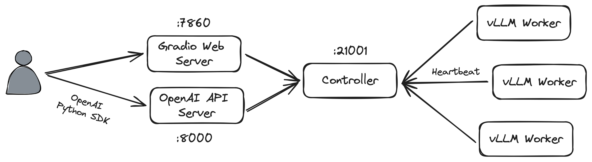

## 背景

[FastChat](https://github.com/lm-sys/FastChat) 是以 UC Berkeley 主导的 [Large Model Systems Organization](https://lmsys.org/) 所开源的面向 LLM 的训练、推理与评估的开放平台，通过该平台可以快速部署多模型的 LLM 服务，并且通过 Web UI 以及兼容 OpenAI API 的 RESTful API 访问。

## 准备工作

### 使用虚拟环境

为了避免潜在的依赖冲突，在安装 Python 相关的依赖的时候推荐使用单独的[虚拟环境](https://docs.python.org/3/library/venv.html)进行管理。

```shell
# initiate virtual environment
python -m venv .venv
# activate virtual environemnt
source .venv/bin/activate
# upgrade `pip`
pip install -U pip
```

### 安装 FastChat

通过 `pip` 安装 FastChat：

```shell
pip install "fschat[model_worker,webui]"
```

> 在特定情况下，在安装过程中有可能会出现找不到 `accelerator` 模块的报错，可通过 `pip install accelerator` 手动安装。

### 安装 vLLM

为了得到更好的推理性能，我们在这边使用 [vLLM](https://github.com/vllm-project/vllm) 作为后端来加速推理。

通过 `pip` 安装 vLLM：

```shell
pip install vllm
```

vLLM 通过 PagedAttention[^pagedattention] 以及基于 Ray 的张量并行来实现了高效的显存管理与并行计算，笔者将在另一篇文章当中详细介绍 vLLM 与 PagedAttention 的设计与实现，此处不再赘述。

### （可选）获取 LLM 模型

由于在测试过程中我们使用的是内网环境，因此没办法在启动 FastChat 时自动下载模型，需要手动从 HuggingFace Hub 下载模型便于离线部署。

Hugging Face 提供了多种方式来下载模型，我们在这边选择使用 `huggingface-cli`。

```shell
pip install -U "huggingface_hub[cli]"
```

```shell
huggingface-cli download --resume-download --local-dir-use-symlinks False --token "hg_TOKEN" meta-llama/Llama-2-7b-chat-hf --local-dir Llama-2-7b-chat-hf
```

## 使用 FastChat 部署 LLM

为了能够通过 Web 和 SDK 访问 LLM 服务，我们需要在服务器上部署以下 FastChat 的组件：

- Controller
- Worker
- Gradio Web Server
- OpenAI API Server



### 启动 Controller

启动 FastChat Controller：

```shell
python3 -m fastchat.serve.controller
```

默认端口为 `21001`，可通过 `--port` 指定。

### 启动 vLLM Worker

基于 vLLM Worker 和 LLM 启动推理服务：

```shell
python3 -m fastchat.serve.vllm_worker meta-llama/Llama-2-7b-chat-hf --num-gpus 2
```

默认端口为 `21002`，可通过 `--port` 指定。FastChat 的 Worker 会向 Controller 注册自身，并通过心跳机制保持连接。

本文使用的是 `meta-llama/Llama-2-7b-chat-hf` 模型，理论上在 FP16 精度下需要约 15G 的显存，因此我们在这边通过指定 `--num-gpus` 参数选择使用两块 RTX 3080（显存为 10G）。

> 本文使用 vLLM 作为推理后端，如果希望使用默认的推理后端的话可使用 `fastchat.serve.model_worker`。

> ~~由于 FastChat 的 vLLM Worker 在实现的时候使用了 [PEP 584](https://peps.python.org/pep-0584/) 中提出的针对字典的 Union Operator，该提案在 Python 3.9 中被实现，因此在 Python 3.8 的环境下运行会报错。[lm-sys/FastChat#2824](https://github.com/lm-sys/FastChat/pull/2824)~~
>
> ~~可执行 `sed -i 's/yield (json.dumps(ret | {"finish_reason": "none"}) + "\\0").encode()/yield (json.dumps({**ret | **{"finish_reason": "none"}}) + "\\0").encode()/g' .venv/venv/lib/python3.8/site-packages/fastchat/serve/vllm_worker.py` 作为临时的解决方案。~~
>
> **2023-12-24 Update:** 该 Pull Request 已被合并，应可在下一次 Release 被修复。

### 启动 Gradio Web Server

FastChat 基于 Gradio 提供了可视化交互聊天界面。

```shell
python3 -m fastchat.serve.gradio_web_server
```

默认端口为 `7860`，可通过 `--port` 指定。

> 如果在启动过程中报错的话，这有可能是由于 Gradio 的版本不兼容导致的，将 Gradio 降级至 3.48.0 即可解决。

### 启动 OpenAI API Server

```shell
python3 -m fastchat.serve.openai_api_server
```

默认端口为 `8000`，可通过 `--port` 指定。

## 使用 OpenAI SDK

> 本文使用的 OpenAI SDK 的版本为 v1，与 v0 版本的接口存在一定的差异，详情请访问 OpenAI Python SDK 的文档。

安装 OpenAI Python SDK：

```shell
pip install openai
```

使用 FastChat OpenAI API Server 的端点初始化 OpenAI 客户端：

```python
from openai import OpenAI

client = OpenAI(base_url="http://localhost:8000/v1", api_key="na")

model = "meta-llama/Llama-2-7b-chat-hf"
```

在启动 OpenAI API Server 的时候可通过参数 `--api-keys` 指定 API Key 的列表，在不指定的情况下在客户端填入任意值皆可。

> 注意：该方法将废弃。

创建 Completion：

```python
prompt = "Once upon a time"

completion = client.completions.create(
    model=model,
    prompt=prompt,
    max_tokens=64
)
print(prompt + completion.choices[0].text)
```

```plaintext
Once upon a time, ......
```

创建 Chat Completion（Default）：

```python
completion = client.chat.completions.create(
    model = model,
    messages=[
        {
            "role": "user",
            "content": "Say this is a test",
        }
    ],
)
print(completion.choices[0].message.content)
```

```plaintext
Hello, ......
```

创建 Chat Completion（Stream）

```python
completion = client.chat.completions.create(
    model = model,
    messages=[
        {
            "role": "user",
            "content": "Say this is a test",
        }
    ],
    stream=True
)

for chunk in completion:
    if chunk.choices[0].finish_reason == "stop":
        break
    else:
        print(chunk.choices[0].delta.content, end="", flush=True)
```

```plaintext
Hello, ......
```

可以访问 [OpenAI API 的文档](https://platform.openai.com/docs/api-reference)获取更多的信息。

## 结语

本文介绍了如何快速使用 FastChat 在服务器上部署 LLM 服务。笔者先前对 LLM 知之甚少，仅通过一些通俗的介绍有着初步的认识，因此能够在这么短的时间内就能基于已有的模型部署出一个可用的 LLM 服务还是相当惊喜的。后续笔者可能还会围绕 LLM 相关的应用与系统进行更深入的了解与探索。

## 附录

### 环境

- Python v3.8.10
- FastChat v0.2.34
- vLLM v0.2.6

### 其它 LLM 推理框架与后端

[ninehills/llm-inference-benchmark](https://github.com/ninehills/llm-inference-benchmark) 提供了多种 LLM 推理框架与后端的性能对比，此处仅列出笔者有了解过的部分系统。

Frameworks:

- [vllm-project/vllm](https://github.com/vllm-project/vllm)
- [bentoml/OpenLLM](https://github.com/bentoml/OpenLLM)
- [oobabooga/text-generation-webui](https://github.com/oobabooga/text-generation-webui)
- [huggingface/text-generation-inference](https://github.com/huggingface/text-generation-inference)
- [xorbitsai/inference](https://github.com/xorbitsai/inference)

Backends:

- [huggingface/transformers](https://github.com/huggingface/transformers)
- [huggingface/candle](https://github.com/huggingface/candle)
- [huggingface/text-generation-inference](https://github.com/huggingface/text-generation-inference)
- [vllm-project/vllm](https://github.com/vllm-project/vllm)
- [NVIDIA/TensorRT-LLM](https://github.com/NVIDIA/TensorRT-LLM)
- [microsoft/DeepSpeed-MII](https://github.com/microsoft/DeepSpeed-MII) / [DeepSpeed-FastGen](https://github.com/microsoft/DeepSpeed/tree/master/blogs/deepspeed-fastgen)

[^pagedattention]: Efficient Memory Management for Large Language Model Serving with PagedAttention. SOSP '23. https://arxiv.org/abs/2309.06180
