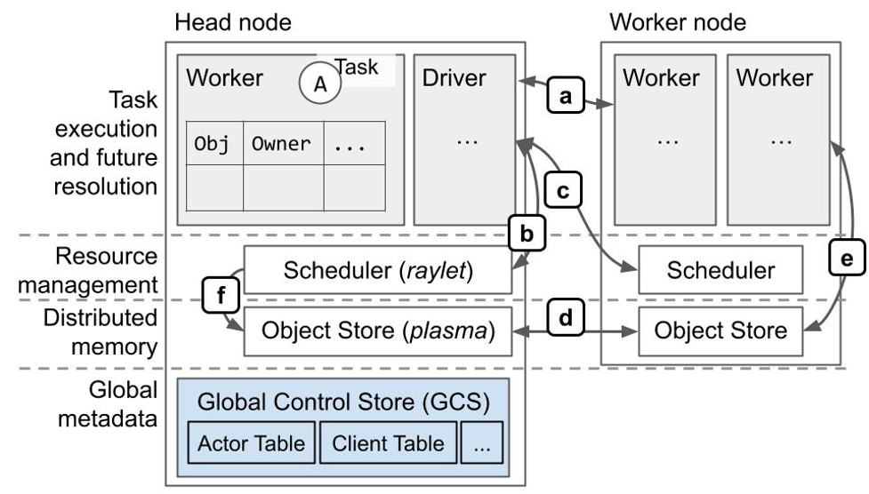
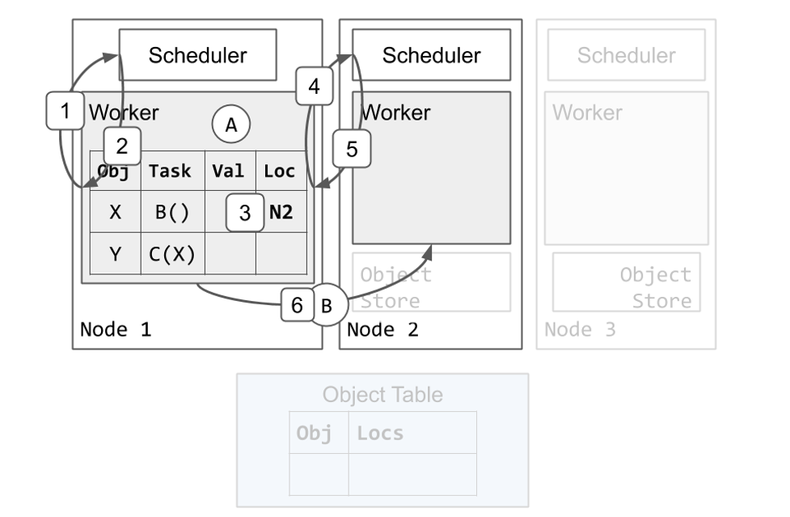
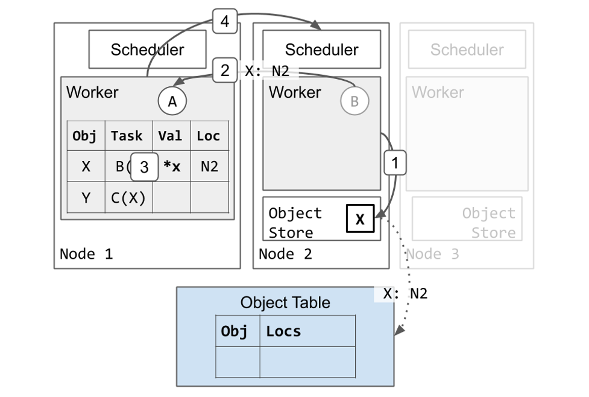
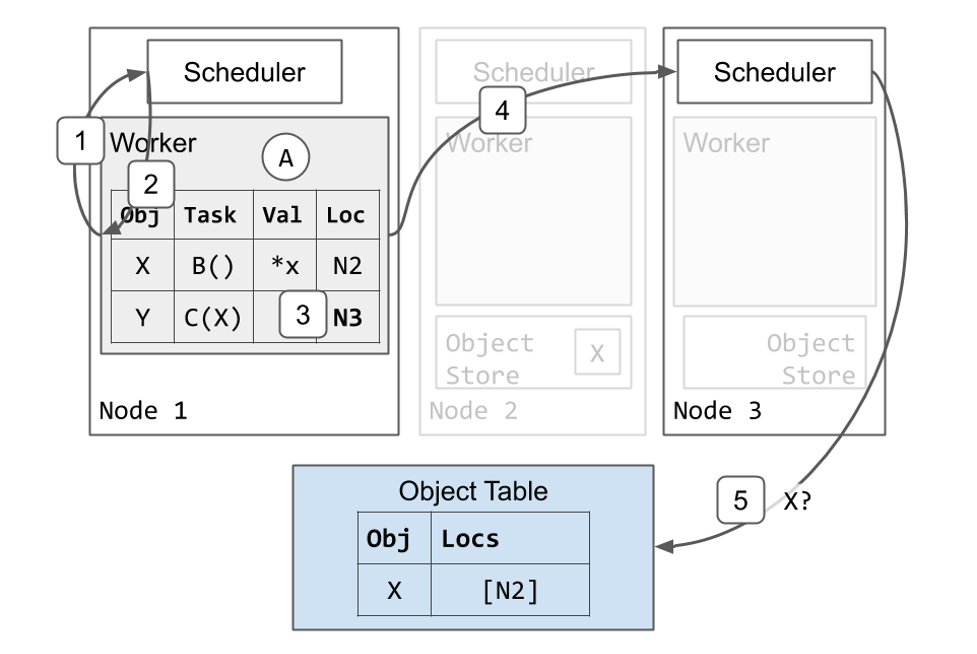
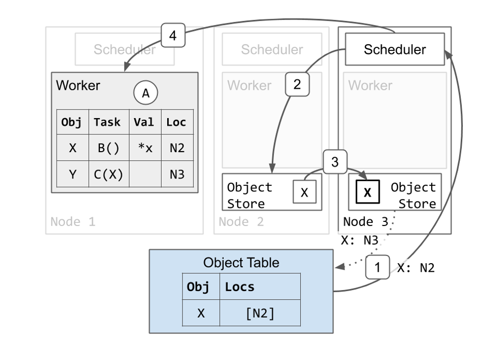
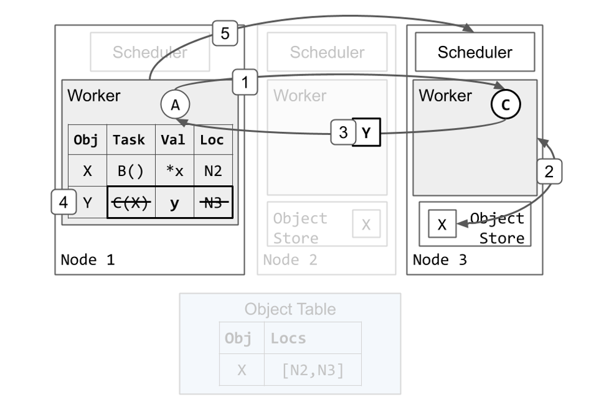
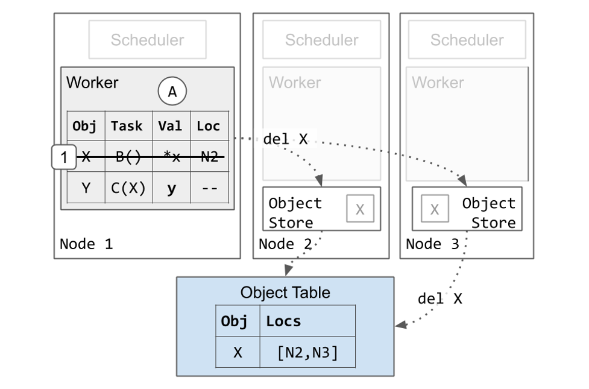

> 本文翻译自 [Ray v2 Architecture](https://docs.google.com/document/d/1tBw9A4j62ruI5omIJbMxly-la5w4q_TjyJgJL_jN2fI/preview) 的 [Appendix](https://docs.google.com/document/d/1tBw9A4j62ruI5omIJbMxly-la5w4q_TjyJgJL_jN2fI/preview#heading=h.kw4bvjvijs8h) 部分，便于梳理 Ray 的调度与对象存储的流程。译文如有错漏还望各位读者斧正。

以下是 Ray 系统架构的更详细的图和示例。

## 架构图



协议概览（大部分基于 gRPC）：

- a. 作业执行、对象引用计数。
- b. 本地资源管理。
- c. 远程/分布式资源管理。
- d. 分布式对象传输。
- e. 大型对象的存储与检索。检索是通过 `ray.get` 或是在任务执行的过程中，将任务的 ObjectID 参数替换成对象的值来完成。
- f. 调度器从远程节点获取对象，以满足本地排队任务的依赖。

## 作业调度与对象存储的示例

我们将逐步展示一个形如如下 Ray 程序的物理执行过程：

```python
@ray.remote
def A():
    y_id = C.remote(B.remote())
    y = ray.get(y_id)
```

在此示例中，Task A 提交 Task B 和 Task C，Task C 依赖 Task B 的输出。为了便于说明，假设 B 返回一个大型 Object X，而 C 返回一个小型 Object Y。这将使得我们能够展示进程内与共享内存对象存储之间的区别。我们还将展示如果 Task A、B 与 C 在不同的节点上执行会发生什么，以便展示分布式调度的工作原理。

### 分布式作业调度

我们由 Worker 1 执行 Task A 开始。Task B 与 Task C 已被提交到 Worker 1 之上，因此 Worker 1 本地的 Ownership 表格已经包括 X 和 Y 的条目。首先，我们会逐步展示一个调度 B 执行过程的示例。



1. Worker 1 向本地的调度器请求资源执行 Task B。
2. Scheduler 1 回复，告诉 Worker 1 在 Node 2 上重试调度请求。
3. Worker 1 更新本地 Ownership 表格，表明 Task B 在 Node 2 上 Pending。
4. Worker 1 向 Node 2 的调度器请求资源执行 Task B。
5. Scheduler 2 向 Worker 1 授予资源并返回 Worker 2 的地址。Scheduler 2 确保当 Worker 1 还保有资源的时候不会有其它的 Task 被安排给 Worker 2。
6. Worker 1 将 Task B 发送给 Worker 2 执行。

### 作业执行

接着，我们会展示一个 Worker 执行 Task 并将返回值存储在分布式对象存储中的例子。



1. Worker 2 完成执行 Task B 并将返回值 X 存储在它的本地对象存储。
   1. Node 2 异步地更新 Object 表格，表明 X 现在在 Node 2 上（虚线箭头）。
   2. 由于这是 X 所被创建的第一个拷贝，Node 2 会固定该拷贝直到 Worker 1 通知 Node 2 可以释放该 Object（未显示）。这保证了 Object 的值在被引用的时候是可达的。
2. Worker 2 向 Worker 1 回复表明 Task B 已完成。
3. Worker 1 更新其本地的 Ownership 表格表明 X 被存储在分布式内存中。
4. Worker 1 将资源归还给 Scheduler 2。Worker 2 现在可以使用这些资源执行其它 Task。

### 分布式作业调度与参数解析

现在 Task B 已完成，Task C 可以开始执行。Worker 1 接着使用与调度 Task B 时相似的协议调度 task C。



1. Worker 1 向本地的调度器请求资源执行 Task C。
2. Scheduler 1 回复，告诉 Worker 1 在 Node 3 上重试调度请求。
3. Worker 1 更新本地 Ownership 表格，表明 Task C 在 Node 3 上 Pending。
4. Worker 1 向 Node 3 的调度器请求资源执行 Task B。
5. Scheduler 3 发现 Task C 依赖 X，但是它在本地对象存储中没有 X 的拷贝。Scheduler 3 将 Task C 加入队列并向 Object 表格询问 X 的位置。

Task C 需要 X 的本地拷贝开始执行，因此 Node 3 获取了 X 的拷贝。



1. Object 表格回复 Scheduler 3 表明 X 在 Node 2 上。
2. 调度器请求 Node 2 上的对象存储发送一个 X 的拷贝。
3. X 从 Node 2 拷贝到 Node 3 上。
   1. Node 3 也会异步地更新 Object 表格表明 X 也在 Node 3 上。
   2. Node 3 的 X 的拷贝被缓存但是不会被固定。当本地 Worker 使用它的时候，该 Object 不会被驱逐。然而，与 Node 2 上的 X 的拷贝不同，Node 3 的拷贝可能会在 Object Store 3 面临内存压力的时候根据 LRU 算法被驱逐。如果前述情况发生，而 Node 3 随后又再次需要该 Object，它可以从 Node 2 再次获取或是使用与前述相同的协议获取另一个拷贝。
4. Node 3 现在有了 X 的本地拷贝，因此 Scheduler 3 将资源授予 Worker 1 并返回 Worker 3 的地址。

### 作业执行与对象内联

Task C 执行并返回一个足够小的 Object，可以被存储在进程内内存存储。



1. Worker 1 将 Task C 发送给 Worker 3 执行。
2. Worker 3 从本地对象存储获取 X 的值（与 `ray.get()` 相似）并运行 `C(x)`。
3. Worker 3 完成执行 Task C 并返回 Y，这次返回的是值而不是将其存储在本地对象存储中。
4. Worker 1 将 Y 存储在它的进程内内存存储中。由于 Task C 已完成执行，它也会消除 Task C 的规格与位置。在这个时间点，Task A 中还未完成的 `ray.get()` 调用会从 Worker 1 的进程内存储寻找并返回 y 的值。
5. Worker 1 将资源归还给 Scheduler 3。Worker 3 现在可以使用这些资源执行其它 Task。这可能会在步骤 4 之前完成。

### 垃圾回收

最后，我们会展示内存是如何被 Worker 清理的。



1. Worker 1 消除 Object X 的条目。这是安全的操作，因为 Pending Task C 过去有对 X 的唯一引用，而现在 Task C 已经完成了。Worker 1 保留 Y 的条目，因为应用依旧拥有对 y 的 ObjectID 的引用。
   1. 最终，所有集群中的 X 的拷贝都会被删除。这可以在步骤 1 之后的任意时间点完成。如前所述，如果 Node 3 的对象存储面临内存压力的情况下，Node 3 的 X 的拷贝可能在步骤 1 之前就被删除。
