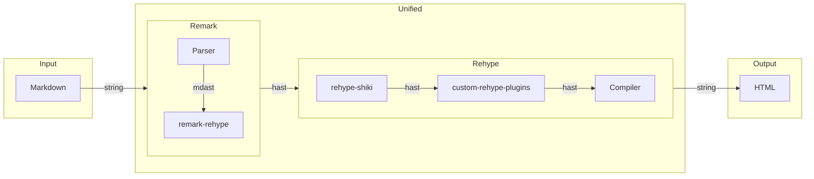

## 背景

Mermaid 是一个基于 JavaScript 的图表绘制工具，其可以通过解析类 Markdown 的语法来实现图表的创建和动态修改[^mermaid]。

Astro 本身并没有提供 Mermaid 相关的第一方集成（[withastro/astro#4433](https://github.com/withastro/astro/issues/4433)），因此为了在 Astro 中支持相关的功能，首先需要简单了解一下 Astro 将 Markdown 解析并渲染成 HTML 文本的过程。



上图展示了 Astro 使用 Remark 与 Rehype 插件渲染 Markdown 文件的部分过程（本文不会涵盖具体的 [`unified`](https://github.com/unifiedjs/unified) 相关的抽象语法树解析过程，如有兴趣可以参考相关的文章[^unified-markdown]），具体包括：

1. 通过 Remark 将输入的 Markdown 文本转换成 Markdown 抽象语法树 `mdast`；
2. 通过 `remark-rehype` 插件将 `mdast` 转换成超文本抽象语法树 `hast`；
3. 若 `syntaxHighlight` 为 `true`，通过 Astro 自定义 `rehype` 插件 `rehype-shiki` 以 [Shiki Transformer](https://shiki.matsu.io/guide/transformers) 的形式支持 Shiki 相关的语法高亮；
4. 运行其它配置中的自定义 `rehype` 插件；
5. 通过编译器（`rehype-stringify`）将 `hast` 重新编译成文本并作为输出导出。

```ts title="astro/packages/markdown/remark/src/shiki.ts#L105-L109"
// Replace "shiki" class naming with "astro-code"
node.properties.class = classValue.replace(/shiki/g, 'astro-code');

// Add data-language attribute
node.properties.dataLanguage = lang;
```

在默认情况下，Astro 的 `rehype-shiki` 会将 Mermaid 代码块直接转换为 `pre.astro-code` 元素作为普通的代码片段渲染。

```html
<pre class="astro-code github-dark" style="background-color:#24292e;color:#e1e4e8; overflow-x: auto;" tabindex="0" data-language="mermaid">
  <code>
  </code>
</pre>
```

因此，一个比较自然的想法就是引入一个 `rehype` 插件来提供对 Mermaid 相关功能解析的支持。

## 使用 `rehype-mermaid`

[`remcohaszing/rehype-mermaid`](https://github.com/remcohaszing/rehype-mermaid) 是一个支持渲染 Mermaid 图像的 `rehype` 插件，其能够将 `<pre class="mermaid">` 与 `<code class="language-mermaid">` 元素替换为渲染后的图像。包含 Mermaid 代码块的 Markdown 文件在经过 `remark-rehype` 插件处理后即会生成符合前述格式的 HTML 代码。

### 安装 `rehype-mermaid`

安装 `rehype-mermaid`：

```shell
pnpm add rehype-mermaid
```

然而，安装 `rehype-mermaid` 后在 `markdown.rehypePlugins` 中直接配置是没办法让其起作用的。如同前文中所提及的，用户的自定义 `rehype` 插件是在 Astro 第一方的 Shiki 插件作用之后的，此时代码高亮相关的片段已经被处理过转换为 `pre.astro-code` 元素，`rehype-mermaid` 插件无法正常识别并渲染。

### 更新 Astro 配置

为了在支持 Shiki 代码高亮的同时启用 Mermaid 支持，需要对 Astro 配置进行更新，如下所示：

```ts title="astro.config.mjs" {3,8,11}
import { defineConfig } from "astro/config";
import { rehypeShiki } from "@astrojs/markdown-remark";
import rehypeMermaid from "rehype-mermaid";

export default defineConfig({
  markdown: {
    rehypePlugins: [
      rehypeMermaid,
      rehypeShiki,
    ],
    syntaxHighlight: false,
  },
});
```

只需要在 Astro 的配置中关闭默认的语法高亮支持，在启用 `rehypeMermaid` 之后重新引入 `rehypeShiki` 即可。需要注意的是如果采用这种方式的话，原先所有 `shiki` 相关的配置都应该作为 `rehypeShiki` 的参数一起传入，如 `[rehypeShiki, { theme: "github-dark" }]`。

此外，由于 `rehype-mermaid` 依赖 `playwright`，如果本地或者 CI 环境没有相关的浏览器二进制文件的话可能会产生如下错误：

```shell
browserType.launch: Executable doesn't exist at /Users/rudeigerc/Library/Caches/ms-playwright/chromium-1134/chrome-mac/Chromium.app/Contents/MacOS/Chromium
```

此时通过 `playwright-core` 人工安装相对应的浏览器即可：

```shell
pnpx playwright-core install --with-deps chromium
```

## References

- [withastro/astro#4433](https://github.com/withastro/astro/issues/4433)
- [remcohaszing/rehype-mermaid](https://github.com/remcohaszing/rehype-mermaid)
- [Astro のブログに Mermaid を導入した | monolithic kernel](https://blog.mono0x.net/2024/02/11/astro-mermaid/)
- [Astro 製のサイトで Markdown 内に書いた Mermaid のダイアグラムを描画する | t28.dev](https://t28.dev/blog/render-mermaid-on-astro-site)

[^mermaid]: [Mermaid | Diagramming and charting tool](https://mermaid.js.org/)
[^unified-markdown]: [如何优雅编译一个 Markdown 文档 - DIYgod](https://diygod.cc/unified-markdown)
