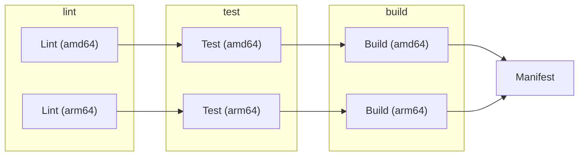

> [!CAUTION]
> [GoogleContainerTools/kaniko](https://github.com/GoogleContainerTools/kaniko) 已于 2025-06-03 归档，不再进行开发和维护，目前由 Chainguard 维护了 [Fork](https://www.chainguard.dev/unchained/fork-yeah-were-bringing-kaniko-back) 的版本 [chainguard-dev/kaniko](https://github.com/chainguard-dev/kaniko)。本文在行文中仍然会使用 `kaniko` 来作为镜像构建的工具，但是会在本文的附录中提供使用其它工具构建的示例。

## 前言

在云原生的时代，容器化应用的部署已经成为主流，而随着多架构处理器的普及，构建支持多种架构的容器镜像已经成为现代 DevOps 流程中的重要环节，开发团队需要确保他们的应用程序能够在不同的处理器架构上无缝运行。
多架构镜像是一种支持多种架构的镜像，其存储的是描述不同架构镜像的清单文件。基于多架构镜像，可以在不同的架构上运行相同的工作负载，不用单独维护不同架构的部署清单。

然而，现有的镜像构建工具如 Docker Buildx、Buildah 等通常需要特权容器来构建多架构镜像，这在特定环境下可能会带来安全隐患，因此用户期望能够在非特权容器中构建多架构镜像。
本文将以 Kaniko 作为镜像构建的工具，展示如何在 GitLab Runner 上使用非特权容器构建多架构镜像。

## 背景

### 多架构镜像

多架构镜像本质上是描述不同架构镜像的清单文件，它包含了指向不同架构镜像的索引，一般多架构镜像会兼容 [Open Container Initiative (OCI) v1](https://specs.opencontainers.org/image-spec/manifest/) 或 [Docker Image Manifest V2 Schema 2](https://distribution.github.io/distribution/spec/manifest-v2-2/) 镜像格式。举例来说，使用 `docker manifest inspect golang:1.24` 可以看到如下结果：

```json
{
  "schemaVersion": 2,
  "mediaType": "application/vnd.oci.image.index.v1+json",
  "manifests": [
    {
      "mediaType": "application/vnd.oci.image.manifest.v1+json",
      "size": 2322,
      "digest": "sha256:9aba206b3974f93f7056304c991c9cc1f843c939159d9305571ab9766c9ccdf6",
      "platform": {
        "architecture": "amd64",
        "os": "linux"
      }
    },
    {
      "mediaType": "application/vnd.oci.image.manifest.v1+json",
      "size": 2324,
      "digest": "sha256:2329251924279916c3d1b727809f6eb18715ba110fc69863872e3bc65b29bbe4",
      "platform": {
        "architecture": "arm",
        "os": "linux",
        "variant": "v7"
      }
    },
    ...
  ]
}
```

在拉取镜像时，客户端会根据当前系统架构选择合适的镜像拉取，使得用户可以在跨不同架构无缝地部署相同的工作负载。

### 多架构镜像的构建

如果需要构建镜像，有以下几种工具供选择：

- [Docker Buildx](https://github.com/docker/buildx)
- [moby/buildkit](https://github.com/moby/buildkit)
- [containers/buildah](https://github.com/containers/buildah)
- [containers/podman](https://github.com/containers/podman)
- [GoogleContainerTools/kaniko](https://github.com/GoogleContainerTools/kaniko) (Archived)

前述四种工具都支持 [QEMU](https://www.qemu.org/) 来模拟不同架构的环境，从而实现跨架构的镜像构建。Kaniko 是 Google 开源的容器镜像构建工具，无需 Daemon 或者特权容器就可以构建容器镜像，但不支持跨架构构建，需要在对应架构的机器上运行才能构建该架构的镜像。其通过直接解析 Dockerfile 中的指令，并在用户空间中执行这些指令逐步构建镜像层，随后将构建好的镜像推送到指定的镜像仓库中。

## 准备工作

下文假设已经在所需架构的机器上安装了 GitLab Runner，此处我们使用 x86_64 和 ARM64 架构的 Runner 进行演示，并且分别设置了 `amd64` 与 `arm64` 的 [Tag](https://docs.gitlab.com/ci/yaml/#tags)。

如果仅有在单架构上运行的 GitLab Runner，需要使用其它工具基于 QEMU 来提供多架构支持，如 Docker Buildx、BuildKit 或 Buildah 等，详见[附录](#附录)部分。

## 构建流水线

```dockerfile title="Dockerfile"
FROM golang:1.24 AS builder
ARG TARGETOS
ARG TARGETARCH

WORKDIR /workspace

# Copy the go source
COPY cmd/ cmd/
COPY pkg/ pkg/

# Build
# the GOARCH has not a default value to allow the binary be built according to the host where the command
# was called. For example, if we call make docker-build in a local env which has the Apple Silicon M1 SO
# the docker BUILDPLATFORM arg will be linux/arm64 when for Apple x86 it will be linux/amd64. Therefore,
# by leaving it empty we can ensure that the container and binary shipped on it will have the same platform.
RUN CGO_ENABLED=0 GOOS=${TARGETOS:-linux} GOARCH=${TARGETARCH} go build -a -o server main.go

# Use distroless as minimal base image to package the binary
# Refer to https://github.com/GoogleContainerTools/distroless for more details
FROM gcr.io/distroless/static:nonroot
WORKDIR /
COPY --from=builder /workspace/server .
USER 65532:65532

ENTRYPOINT ["/server"]
```

这是一个标准的构建 Go 应用的 Dockerfile，使用了多阶段的构建方式并使用 [Distroless](https://github.com/GoogleContainerTools/distroless) 作为基础镜像。它会接受 `TARGETOS` 和 `TARGETARCH` 两个参数来指定目标操作系统和架构，在使用 Buildkit 作为镜像的构建后端的时候会自动传递这两个参数[^dockerfile#automatic-platform-args]，并将其传入 `go build` 命令中的 `GOOS` 与 `GOARCH` 环境变量中。



上图是一个简单的示意图，展示了在 GitLab Runner 上运行 DevOps Pipeline 的基本流程。

### 使用 Kaniko 构建镜像

为了支持在不同架构上构建镜像，我们定义了 `matrix` 变量来指定不同的系统架构。

```yaml
build:
  stage: build
  image:
    name: gcr.io/kaniko-project/executor:v1.24.0-debug
    entrypoint: [""]
  variables:
    TARGETARCH: ${GOARCH}
    TARGETOS: ${GOOS}
  before_script:
    - mkdir -p /kaniko/.docker
    - echo "{\"auths\":{\"$CI_REGISTRY\":{\"username\":\"$CI_REGISTRY_USER\",\"password\":\"$CI_REGISTRY_PASSWORD\"}}}" > /kaniko/.docker/config.json
  parallel:
    matrix:
      - GOOS: linux
        GOARCH: amd64
      - GOOS: linux
        GOARCH: arm64
  tags:
    - ${GOARCH}
  script:
    - |
      /kaniko/executor \
        --context "${CI_PROJECT_DIR}" \
        --dockerfile "${CI_PROJECT_DIR}/Dockerfile" \
        --destination "${CI_REGISTRY_IMAGE}:${CI_COMMIT_SHORT_SHA}-${GOARCH}" \
        --build-arg TARGETOS=${GOOS} \
        --build-arg TARGETARCH=${GOARCH}
```

在 GitLab Runner 上使用 Kaniko 构建镜像时，首先需要指定 Docker Credentials，以便 Kaniko 有权限能够推送镜像到镜像仓库中。

- `--context`：指定构建上下文，通常是项目的根目录；
- `--dockerfile`：指定 Dockerfile 的路径；
- `--destination`：指定构建完成后推送到的镜像仓库地址。
- `--build-arg`：指定 Dockerfile 中的构建参数 `ARG`。

构建结束后，Kaniko 会将构建好的镜像（`<image>:<sha256>-amd64` 与 `<image>:<sha256>-arm64`）推送到指定的镜像仓库中。

### 使用 Manifest Tool 构建多架构镜像

```yaml
manifest:
  stage: manifest
  image:
    name: mplatform/manifest-tool:alpine-v2.2.0
    entrypoint: [""]
  tags:
    - amd64
  script:
    - |
      manifest-tool \
        --username=${CI_REGISTRY_USER} --password=${CI_REGISTRY_PASSWORD} \
        push from-args --platforms linux/amd64,linux/arm64 \
        --template ${CI_REGISTRY_IMAGE}:${CI_COMMIT_SHORT_SHA}-ARCH \
        --target ${CI_REGISTRY_IMAGE}:${CI_COMMIT_SHORT_SHA}
```

此时，`<image>:<sha256>-amd64` 与 `<image>:<sha256>-arm64` 两个支持 `amd64` 与 `arm64` 架构的镜像已经被推送到镜像仓库中，接下来需要利用工具来构建多架构镜像清单。[estesp/manifest-tool](https://github.com/estesp/manifest-tool) 是一个用来浏览和推送多架构镜像清单的工具，支持 [Open Container Initiative (OCI) v1](https://specs.opencontainers.org/image-spec/manifest/) 与 [Docker Image Manifest V2 Schema 2](https://distribution.github.io/distribution/spec/manifest-v2-2/) 的镜像格式。

可以通过 manifest-tool 来基于先前构建好的不同架构的镜像来建立并推送多架构镜像清单。

`from-args` 参数：

- `--platforms`：待构建的镜像清单的架构列表，格式为 `OS/ARCH/VARIANT?` 并以逗号分隔，其中 `VARIANT` 为可选项，如 `linux/amd64,linux/arm64`；
- `--template`：待构建的镜像模板，其中 `OS`、`ARCH` 与 `VARIANT` 会被替换为 `--platforms` 中指定的架构，如 `image:latest-ARCH`；
- `--target`：最终推送的多架构镜像清单的名称，如 `image:latest`。

Manifest Tool 会根据 `<image>:<sha256>-amd64` 与 `<image>:<sha256>-arm64` 构建多架构镜像清单 `<image>:<sha256>`，并将其推送到指定的镜像仓库中。

## 使用缓存加速构建

至此，我们已经可以在 GitLab Runner 上使用 Kaniko 构建多架构镜像了，拉取 `<image>:<sha256>` 时会根据客户端的系统架构自动选择合适的镜像进行拉取。
但是如果直接使用前述的配置构建镜像的话，会发现每次构建都会重新下载依赖并重新编译代码，这会导致构建速度的显著降低，因此自然而然地就可以想到需要利用缓存来加速构建过程。
[GoogleContainerTools/kaniko#969](https://github.com/GoogleContainerTools/kaniko/issues/969) 中对如何在 Kaniko 中使用缓存加速构建有着详细的讨论，本文采用以下两种方式来加速构建过程：

1. 使用 Kaniko 本身的缓存机制
2. 使用 GitLab Runner 的缓存机制结合 Go 的模块缓存

### 使用 Kaniko 缓存

Kaniko 本身提供了多种缓存方式来加速构建过程，即通过配置 `--cache-run-layers` 与 `--cache-copy-layers` 来分别缓存使用 `RUN` 与 `COPY` 的镜像层。在执行命令前，Kaniko 会先计算镜像层的摘要值来确定缓存是否存在，如果存在则会拉取并复用缓存而不会执行该镜像层的指令。

```diff
  script:
    - |
      /kaniko/executor \
+       --cache=true \
+       --cache-run-layers \
+       --cache-copy-layers \
+       --cache-repo="${CI_REGISTRY_IMAGE}/cache" \
+       --cache-ttl=24h \
        --context "${CI_PROJECT_DIR}" \
        --dockerfile "${CI_PROJECT_DIR}/Dockerfile" \
        --destination "${CI_REGISTRY_IMAGE}:${CI_COMMIT_SHORT_SHA}-${GOARCH}" \
        --build-arg TARGETOS=${GOOS} \
        --build-arg TARGETARCH=${GOARCH}
```

- `--cache`：启用缓存功能；
- `--cache-run-layers`：缓存使用 `RUN` 指令创建的镜像层；
- `--cache-copy-layers`：缓存使用 `COPY` 指令创建的镜像层；
- `--cache-repo`：指定缓存存储的镜像仓库地址；
- `--cache-ttl`：指定缓存的 TTL。

### 使用 Go 缓存

除了使用 Kaniko 本身的缓存机制以外，我们还可以结合 GitLab Runner 的缓存机制结合 Go 的模块缓存来加速。

Go 本身使用以下两种缓存：

- `GOCACHE`：Go 的构建缓存目录；
- `GOMODCACHE`：Go 的模块缓存目录，详见 [Module Cache](https://go.dev/ref/mod#module-cache)。

> [!NOTE]
> 如果使用的是 Docker Buildx 等使用 Daemon 的构建工具，可以选择在 Dockerfile 中使用 `RUN --mount=type=cache` 来缓存 Go 模块。

由于我们需要构建多架构的镜像，虽然 Go 的模块缓存是可以在不同架构间共享的，但是最好规避不同架构下的 Go 的构建缓存。

```yaml
.go-cache:
  cache:
    - key:
        files:
          - go.mod
          - go.sum
      fallback_keys:
        - go-mod-cache
      paths:
        - .cache/go-mod/
      policy: pull-push
    - key: go-build-${GOARCH:-amd64}-${CI_COMMIT_REF_SLUG}
      fallback_keys:
        - go-build-${GOARCH:-amd64}
      paths:
        - .cache/go-build-${GOARCH:-amd64}/
      policy: pull-push
  before_script:
    - mkdir -p .cache/go-mod .cache/go-build-${GOARCH:-amd64}
    - export GOMODCACHE="$(pwd)/.cache/go-mod"
    - export GOCACHE="$(pwd)/.cache/go-build-${GOARCH:-amd64}"
```

此处定义了一个 `.go-cache` 的模板，包含了 Go 模块缓存与构建缓存的配置。在具体的 Job 中使用时，只需要继承 `.go-cache` 模板即可：

```yaml
build:
  extends: .go-cache
  ...
```

## 结语

随着多架构处理器的普及，构建支持多种架构的容器镜像已经成为现代 DevOps 流程中的重要环节。本文详细介绍了如何在 GitLab Runner 环境下使用 Kaniko 在非特权容器中实现多架构镜像的构建，并介绍了相应的流水线的构建配置。此外，本文通过结合 Kaniko 的缓存机制和 GitLab Runner 缓存功能与 Go 缓存机制的继承，有效地提升了镜像构建的效率。

## 参考

- [Faster Multi-Platform Builds: Dockerfile Cross-Compilation Guide | Docker](https://www.docker.com/blog/faster-multi-platform-builds-dockerfile-cross-compilation-guide/)
- [Developer’s Journal: Building Unprivileged Multi-Arch Images with Kaniko and Gitlab CI - ArborXR](https://arborxr.com/blog/developers-journal-building-unprivileged-multi-arch-images-with-kaniko-and-gitlab-ci)
- [Build Docker images with BuildKit | GitLab Docs](https://docs.gitlab.com/ci/docker/using_buildkit/#build-multi-platform-images)

[^dockerfile#automatic-platform-args]: [Dockerfile reference | Docker Docs](https://docs.docker.com/reference/dockerfile/#automatic-platform-args-in-the-global-scope)

## 附录

附录中提供了一些示例代码片段。

### 使用 Kaniko

```yaml title=".gitlab-ci.yml"
stages:
  - build
  - manifest

build:
  stage: build
  image:
    name: gcr.io/kaniko-project/executor:v1.24.0-debug
    entrypoint: [""]
  variables:
    TARGETARCH: ${GOARCH}
    TARGETOS: ${GOOS}
  before_script:
    - mkdir -p /kaniko/.docker
    - echo "{\"auths\":{\"$CI_REGISTRY\":{\"username\":\"$CI_REGISTRY_USER\",\"password\":\"$CI_REGISTRY_PASSWORD\"}}}" > /kaniko/.docker/config.json
  parallel:
    matrix:
      - GOOS: linux
        GOARCH: amd64
      - GOOS: linux
        GOARCH: arm64
  tags:
    - ${GOARCH}
  script:
    - |
      /kaniko/executor \
        --context "${CI_PROJECT_DIR}" \
        --dockerfile "${CI_PROJECT_DIR}/Dockerfile" \
        --destination "${CI_REGISTRY_IMAGE}:${CI_COMMIT_SHORT_SHA}-${GOARCH}" \
        --build-arg TARGETOS=${GOOS} \
        --build-arg TARGETARCH=${GOARCH} \
        --cache=true \
        --cache-run-layers \
        --cache-copy-layers \
        --cache-repo="${CI_REGISTRY_IMAGE}/cache" \
        --cache-ttl=24h

manifest:
  stage: manifest
  image:
    name: mplatform/manifest-tool:alpine-v2.2.0
    entrypoint: [""]
  tags:
    - amd64
  script:
    - |
      manifest-tool \
        --username=${CI_REGISTRY_USER} --password=${CI_REGISTRY_PASSWORD} \
        push from-args --platforms linux/amd64,linux/arm64 \
        --template ${CI_REGISTRY_IMAGE}:${CI_COMMIT_SHORT_SHA}-ARCH \
        --target ${CI_REGISTRY_IMAGE}:${CI_COMMIT_SHORT_SHA}
```

### 使用 Rootless BuildKit

可参考 GitLab 的相关文档 [Build Docker images with BuildKit](https://docs.gitlab.com/ci/docker/using_buildkit/)。

> [!WARNING]
> 需要设置 `user.max_user_namespaces` 以允许在容器中使用 User Namespace。

```yaml title=".gitlab-ci.yml"
stages:
  - build
  - manifest

build:
  image: moby/buildkit:rootless
  stage: build
  variables:
    BUILDKITD_FLAGS: --oci-worker-no-process-sandbox
    CACHE_IMAGE: $CI_REGISTRY_IMAGE:cache
    TARGETARCH: ${GOARCH}
    TARGETOS: ${GOOS}
  before_script:
    - mkdir -p ~/.docker
    - echo "{\"auths\":{\"$CI_REGISTRY\":{\"username\":\"$CI_REGISTRY_USER\",\"password\":\"$CI_REGISTRY_PASSWORD\"}}}" > ~/.docker/config.json
  parallel:
    matrix:
      - GOOS: linux
        GOARCH: amd64
      - GOOS: linux
        GOARCH: arm64
  tags:
    - ${GOARCH}
  script:
    - |
      buildctl-daemonless.sh build \
        --frontend dockerfile.v0 \
        --local context=. \
        --local dockerfile=. \
        --export-cache type=registry,ref=$CACHE_IMAGE \
        --import-cache type=registry,ref=$CACHE_IMAGE \
        --output type=image,name=$CI_REGISTRY_IMAGE:$CI_COMMIT_SHORT_SHA-$GOARCH,push=true

manifest:
  stage: manifest
  image:
    name: mplatform/manifest-tool:alpine-v2.2.0
    entrypoint: [""]
  script:
    - |
      manifest-tool \
        --username=${CI_REGISTRY_USER} --password=${CI_REGISTRY_PASSWORD} \
        push from-args --platforms linux/amd64,linux/arm64 \
        --template $CI_REGISTRY_IMAGE:$CI_COMMIT_SHORT_SHA-$GOARCH \
        --target $CI_REGISTRY_IMAGE:$CI_COMMIT_SHORT_SHA
```

### 使用 Buildah

可参考 GitLab 的相关文档 [Tutorial: Use Buildah in a rootless container with GitLab Runner Operator on OpenShift](https://docs.gitlab.com/ci/docker/buildah_rootless_tutorial/)。

> [!WARNING]
> 需要设置 `user.max_user_namespaces` 以允许在容器中使用 User Namespace，详见 [Troubleshooting](#troubleshooting) 部分。

```yaml title=".gitlab-ci.yml"
stages:
  - build
  - manifest

build:
  image: quay.io/buildah/stable
  stage: build
  variables:
    STORAGE_DRIVER: vfs
    BUILDAH_FORMAT: docker
    TARGETARCH: ${GOARCH}
    TARGETOS: ${GOOS}
  before_script:
    - echo "$CI_REGISTRY_PASSWORD" | buildah login -u "$CI_REGISTRY_USER" --password-stdin $CI_REGISTRY
  parallel:
    matrix:
      - GOOS: linux
        GOARCH: amd64
      - GOOS: linux
        GOARCH: arm64
  tags:
    - ${GOARCH}
  script:
    - buildah build --build-arg TARGETOS=$GOOS --build-arg TARGETARCH=$GOARCH -t $CI_REGISTRY_IMAGE:$CI_COMMIT_SHORT_SHA-$GOARCH .
    - buildah push $CI_REGISTRY_IMAGE:$CI_COMMIT_SHORT_SHA-$GOARCH

manifest:
  stage: manifest
  image: quay.io/buildah/stable
  tags:
    - amd64
  script:
    - buildah manifest create $CI_REGISTRY_IMAGE:$CI_COMMIT_SHORT_SHA
    - buildah manifest add --os=linux --arch=amd64 $CI_REGISTRY_IMAGE:$CI_COMMIT_SHORT_SHA $CI_REGISTRY_IMAGE:$CI_COMMIT_SHORT_SHA-amd64
    - buildah manifest add --os=linux --arch=arm64 --variant v8 $CI_REGISTRY_IMAGE:$CI_COMMIT_SHORT_SHA $CI_REGISTRY_IMAGE:$CI_COMMIT_SHORT_SHA-arm64
    - buildah manifest push --all $CI_REGISTRY_IMAGE:$CI_COMMIT_SHORT_SHA
```

### Troubleshooting

在使用 BuildKit 或 Buildah 等工具时，可能会遇到 `user.max_user_namespaces` 的限制问题。

在 Kubernetes 集群中使用 GitLab Runner 时，可参考 BuildKit 所提供的使用特权容器的 DaemonSet 来配置节点的 `user.max_user_namespaces` 参数，以允许在容器中使用 User Namespace。

```yaml title="sysctl-userns.privileged.yaml"
apiVersion: apps/v1
kind: DaemonSet
metadata:
  labels:
    app: sysctl-userns
  name: sysctl-userns
spec:
  selector:
    matchLabels:
      app: sysctl-userns
  template:
    metadata:
      labels:
        app: sysctl-userns
    spec:
      containers:
        - name: sysctl-userns
          image: busybox
          command: ["sh", "-euxc", "sysctl -w user.max_user_namespaces=63359 && sleep infinity"]
          securityContext:
            privileged: true
```
