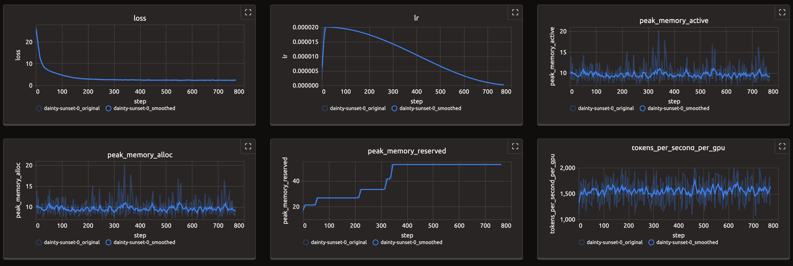

## 前言

在 MLOps 的工程实践中，实验跟踪是机器学习训练中的重要组成部分。在前一篇[文章](https://rudeigerc.dev/posts/customized-training-callbacks-with-llama-factory/)中，笔者介绍了如何基于 Transformers Trainer 实现自定义的 Training Callback 来实现定制化的实验跟踪。

然而，当需要将自定义的实验跟踪系统对接不同的 LLM 微调框架，或是集成传统的机器学习框架（如 PyTorch、XGBoost 与 LightGBM）时，我们需要根据不同框架的抽象层次实现特定的接口，并通过框架特定的方式在训练过程中指定使用自定义的 Logger 或 Tracker。这种方式容易引入额外的开发以及维护成本，特别是在需要支持多个框架的场景下。MLflow 作为业界广泛采用的机器学习实验管理平台，提供了 Autologging 功能和插件机制。Google Cloud 的 Vertex AI Experiments 便基于前述机制通过 MLflow 的 Python SDK 提供 Autologging 集成，无需针对每个框架单独实现接口，而是复用 MLflow 的现有实现。

本文将以 Google Cloud 的 Vertex AI Experiments 为例，深入介绍如何基于 MLflow 的插件机制对接外部实验跟踪系统，并实现 Autologging 集成。此外，本文还会展示如何自行实现一个简单的 MLflow 插件，并将其与微调框架集成，以便在支持 MLflow 的微调框架中将实验跟踪数据代理到外部系统。

## 背景

### MLflow 的 Autologging

MLflow 是 Databricks 开源的机器学习模型管理与实验跟踪的平台，提供了丰富的功能来跟踪实验、管理模型和性能评估，其 Autologging 功能可以自动记录特定机器学习框架中的训练过程中的参数、指标和模型等信息，用户不需要过多手动介入即可实现模型元数据管理与实验跟踪。`mlflow.utils.autologging_utils` 中的 `safe_patch` 函数是 MLflow Tracking 中 Autologging 功能的核心，其主要功能在于将 MLflow 自定义实现的框架集成的部分注入到训练框架中的特定函数，从而实现无缝的集成。

```python
def safe_patch(
    autologging_integration,
    destination,
    function_name,
    patch_function,
    manage_run=False,
    extra_tags=None,
)
```

- `autologging_integration`：要应用补丁的 Autologging 集成。
- `destination`：适用补丁的 Python 类。
- `function_name`：适用补丁的 `destination` 类中的函数名称。
- `patch_function`：被适用的补丁函数。
- `manage_run`：是否自动管理 MLflow 的 Run。
- `extra_tags`：要添加到被管理的 MLflow Run 的额外标签。

以 [Pytorch Lightning](https://github.com/mlflow/mlflow/tree/master/mlflow/pytorch) 为例，在 `autolog` 函数中会调用 `safe_patch(FLAVOR_NAME, pl.Trainer, "fit", patched_fit, manage_run=True, extra_tags=extra_tags)`，其中 `FLAVOR_NAME` 是 `pytorch`，`patched_fit` 是 `pytorch_lightning.Trainer.fit` 的 Wrapper 函数，涵盖了对训练过程中参数、指标与模型的自动化记录，其主要基于 PyTorch Lighting 的 [Callback](https://lightning.ai/docs/pytorch/stable/extensions/callbacks.html) 机制来实现。

```python
from lightning.pytorch.callbacks import Callback

class MyPrintingCallback(Callback):
    def on_train_start(self, trainer, pl_module):
        print("Training is starting")

    def on_train_end(self, trainer, pl_module):
        print("Training is ending")

trainer = Trainer(callbacks=[MyPrintingCallback()])
```

### Vertex AI Experiments

[Vertex AI Experiments](https://cloud.google.com/vertex-ai/docs/experiments/intro-vertex-ai-experiments) 是 Google Cloud 的 Vertex AI 平台提供的实验跟踪系统，可以跟踪与分析不同的训练任务中的元数据、超参数以及训练过程中的指标等数据，根据这些数据，用户可以更便利地进行实验管理从而确定将来的实验路径。Vertex AI Experiments 将一个**实验（Experiment）**作为实验管理的基本单位，一个实验可包含多个**流水线运行作业（PipelineJob Runs）**与多个**实验运行作业（Experiment Runs）**。一个 Experiment Run 中包含超参数、指标、PipelineJob 与 Artifact 等数据。

- 实验（Experiment）：实验管理的基本单位。
- 实验运行作业（Experiment Run）：一个实验的具体一次运行，包含该次运行的超参数、指标等信息，用于监控机器学习训练任务的过程。Experiment Run 创建的时候需指定具体的 Experiment。
- 流水线运行作业（Pipeline Job Run）：流水线作业 `PipelineJob` 的运行实体，流水线运行作业由流水线作业的参数创建。

在下文中，本文将基于 Google Cloud 的 [AI Platform Python SDK](https://github.com/googleapis/python-aiplatform) 来介绍 Google Cloud 如何基于 MLflow 的插件机制与 Vertex AI Experiments 进行集成。

## 自定义的 MLflow Tracking 插件

要实现自定义的 MLflow Tracking 插件，需要继承 `mlflow.tracking.AbstractStore` 类，并实现其抽象方法。

```python title="google/cloud/aiplatform/_mlflow_plugin/_vertex_mlflow_tracking.py"
class _VertexMlflowTracking(abstract_store.AbstractStore):

    def __init__(self, store_uri: str | None, artifact_uri: str | None):
        pass

    @override
    def create_run(
        self,
        experiment_id: str,
        user_id: str,
        start_time: int,
        tags: list["RunTag"],
        run_name: str,
    ) -> Run:
        pass

    @override
    def update_run_info(
        self,
        run_id: str,
        run_status: RunStatus,
        end_time: int,
        run_name: str,
    ) -> RunInfo:
        pass

    @override
    def log_batch(
        self,
        run_id: str,
        metrics: list["Metric"],
        params: list["Param"],
        tags: list["RunTag"],
    ) -> None:
        pass

    @override
    def get_run(self, run_id: str) -> Run:
        pass
```

如果只需要集成基本的实验跟踪功能，只需要实现前述的几个接口即可。

- `create_run`：创建一个新的实验运行。Vertex 插件基于特定 Vertex AI 的 Experiment 创建 Experiment Run，并创建对应的 MLflow Run。
- `update_run_info`：更新实验运行的信息。Vertex 插件根据传入的 MLflow Run 状态结束或者更新对应的 Experiment Run 的状态。
- `log_batch`：记录一批实验数据。根据传入的 `metrics` 与 `params`，更新超参数与指标或时间序列指标到对应的 Experiment Run 中。
- `get_run`：获取实验运行的详细信息。根据传入的 `run_id` 从 `run_id` 与 Experiment Run 的 Mapping 中构建并返回对应的 MLflow Run。

## Autologging 集成

MLflow Tracking 实现了 Autologging 的功能，针对 PyTorch Lightning、XGBoost 与 LightGBM 等框架，只需要调用 `mlflow.autolog()` 即可实现自动化的实验跟踪。

```python title="google/cloud/aiplatform/metadata/metadata.py"
def _initialize_mlflow_plugin():
    """Invokes the Vertex MLFlow plugin.

    Adding our log filter to MLFlow before calling mlflow.autolog() with
    silent=False will only surface warning logs when the installed ML
    framework version used for autologging is not supported by MLFlow.
    """

    import mlflow
    from mlflow.tracking._tracking_service import utils as mlflow_tracking_utils
    from google.cloud.aiplatform._mlflow_plugin._vertex_mlflow_tracking import (
        _VertexMlflowTracking,
    )

    # Only show MLFlow warning logs for ML framework version mismatches
    logging.getLogger("mlflow").setLevel(logging.WARNING)
    logging.getLogger("mlflow.tracking.fluent").disabled = True
    logging.getLogger("mlflow.utils.autologging_utils").addFilter(
        _MLFlowLogFilter()
    )

    mlflow_tracking_utils._tracking_store_registry.register(
        "vertex-mlflow-plugin", _VertexMlflowTracking
    )

    mlflow.set_tracking_uri("vertex-mlflow-plugin://")

    mlflow.autolog(
        log_input_examples=False,
        log_model_signatures=False,
        log_models=False,
        silent=False,  # using False to show unsupported framework version warnings with _MLFlowLogFilter
    )
```

Vertex AI 的 Python SDK 对其进行了简单的封装，用户可以分别使用 `aiplatform.autolog()` 与 `aiplatform.autolog(disable=True)` 来控制自动化实验跟踪的开启与关闭，这与 MLflow 的用法一致。在调用 `aiplatform.autolog()` 时，SDK 会自动注册并设置使用 `vertex-mlflow-plugin` 插件，随后便开启 MLflow 的 Autologging 功能。MLflow 在调用 Tracking 相关 API 的时候，会根据当前的 Tracking URI 自动选择使用对应的插件。

## Demo: trackio-mlflow

在了解了 MLflow 的插件机制和 Autologging 集成之后，笔者实现了一个简单的插件 [rudeigerc/trackio-mlflow](https://github.com/rudeigerc/trackio-mlflow)，它是一个用于将基于 MLflow 的实验跟踪数据发送到 [TrackIO](https://trackio.com/) 的 Demo 插件。Trackio 是 Gradio（Hugging Face）开源的实验跟踪工具，它提供了轻量级的 API 来记录实验数据，并可将其与 Hugging Face Space 集成。在该插件中，笔者实现了前述的几个接口，可通过 `pip` 安装此插件：

```bash
pip install git+https://github.com/rudeigerc/trackio-mlflow.git
```

### 注册 MLflow 插件

MLflow 提供了基于 Entrypoint 的插件注册机制，可以通过在 `pyproject.toml` 文件中添加以下 Entrypoint 来注册自定义插件：

```toml title="pyproject.toml"
[project.entry-points."mlflow.tracking_store"]
trackio = "trackio_mlflow.store:TrackioStore"
```

此处 Entrypoint 的作用与 Vertex AI Experiments 中的 `mlflow_tracking_utils._tracking_store_registry.register` 作用相同，会将 `trackio` 注册为一个新的 MLflow 插件的 Scheme。如果需要使用插件，只需要显式调用 `mlflow.set_tracking_uri("trackio://")`，或是将环境变量 `MLFLOW_TRACKING_URI` 设置为 `trackio://` 即可，在 MLflow 调用相应函数的时候即会调用插件中实现的函数。

### 集成 Torchtune

为了验证插件在支持 MLflow 的框架中的效果，笔者此处使用 [Kubeflow Trainer](https://github.com/kubeflow/trainer) 与 [Torchtune](https://github.com/pytorch/torchtune) 运行基于 Gemma 2 的 LoRA 微调任务。Torchtune 默认支持基于 Disk、Wandb、Tensorboard 与 MLflow 的实验跟踪，此处指定使用 `MLFlowLogger` 进行实验跟踪，并将 `tracking_uri` 设置为 `trackio://` 即可。

```bash
tune run \
  lora_finetune_single_device \
  ... \
  metric_logger._component_=torchtune.training.metric_logging.MLFlowLogger \
  metric_logger.tracking_uri=trackio://
```

> [!WARNING]
> 由于 Torchtune 在配置中默认使用的 Metric Logger 是 `DiskLogger`，且有参数 `log_dir`，在直接使用 `MLFlowLogger` 时会导致以下错误：
>
> ```log
> TypeError: MLFlowLogger.init() got an unexpected keyword argument 'log_dir'
> ```
>
> 笔者此处直接在搭建镜像的过程中使用 `sed -i '/log_dir: \${output_dir}\/logs/d' <path-to-site-packages>/recipes/configs/gemma2/2B_lora_single_device.yaml` 在对应的配置中删除了此项。由于 Torchtune 目前处于 Sunset 的阶段，如果需要较为优雅地规避这个问题的话可使用自行编写的 Config。

为了在实验过程中观测实验的指标，笔者此处使用 Kubernetes 的 [Sidecar Container](https://kubernetes.io/docs/concepts/workloads/pods/sidecar-containers/) 单独运行了 Trackio 的 Dashboard，并与训练任务的容器共享了 `~/.cache/huggingface/trackio` 目录，Trackio 默认将数据记录在该路径下的 SQLite 文件中。

```yaml
initContainers:
  - name: trackio
    restartPolicy: Always
    image: ghcr.io/rudeigerc/trackio:0.2.2
    command:
      - trackio
    args:
      - show
    ports:
      - containerPort: 7860
        name: trackio
    volumeMounts:
      - name: trackio
        mountPath: /root/.cache/huggingface/trackio
```

Trackio 的 Service：

```yaml
apiVersion: v1
kind: Service
metadata:
  name: trackio
spec:
  type: ClusterIP
  selector:
    jobset.sigs.k8s.io/jobset-name: tune-gemma2-lora-with-alpaca
  ports:
  - name: trackio
    port: 7860
    targetPort: 7860
    protocol: TCP
```

> [!TIP]
> 如果不是在 Kubernetes 中运行微调任务，可直接运行 `tune run <args>` 并使用 `trackio show` 后通过 `http://localhost:7860` 查看 Trackio 的 Dashboard 即可。

通过配置对应的 Ingress 或是直接使用 `kubectl port-forward`，可通过本地浏览器访问 Trackio 的 Dashboard。



## 结语

通过对 MLflow 的 Autologging 功能的深入了解，以及以 Google Cloud 的 Vertex AI Experiments 为例，本文展示了如何基于 MLflow 的插件机制集成自定义的实验跟踪。相比于针对不同框架分别实现特定的接口，基于 MLflow 插件机制的方案具有更好的通用性和可维护性，能够以统一的方式支持多种机器学习框架的实验跟踪需求。通过实现 `trackio-mlflow` 插件的示例，可以看到前述方案不仅能够有效地将实验数据代理到外部系统，还能够与现有的机器学习框架无缝集成，为机器学习工程师提供了更加灵活的实验管理解决方案。

## 参考

- [Automatic Logging with MLflow Tracking | MLflow](https://mlflow.org/docs/latest/ml/tracking/autolog/)
- [Autolog data to an experiment run | Vertex AI | Google Cloud](https://cloud.google.com/vertex-ai/docs/experiments/autolog-data)
- [python-aiplatform/google/cloud/aiplatform/_mlflow_plugin at main · googleapis/python-aiplatform](https://github.com/googleapis/python-aiplatform/tree/main/google/cloud/aiplatform/_mlflow_plugin)
- [MLFlowLogger — torchtune 0.6 documentation](https://docs.pytorch.org/torchtune/stable/generated/torchtune.training.metric_logging.MLFlowLogger.html)
