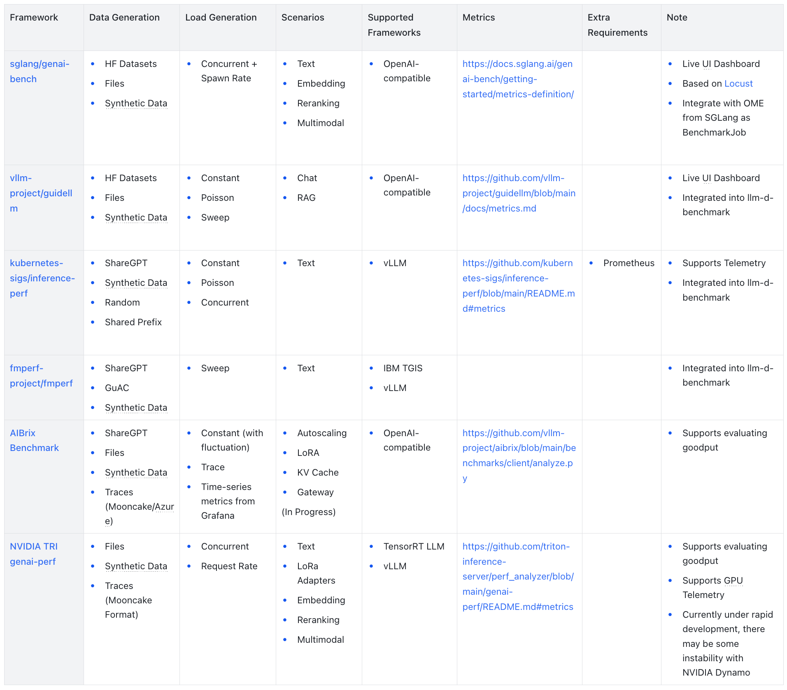

## Overview

With the widespread adoption of Large Language Models (LLMs) in applications, LLM inference services have emerged as core components of modern artificial intelligence infrastructure. In production environments, LLM inference services encounter heterogeneous workloads, where different application scenarios have vastly different requirements for SLOs, or service level objectives, such as latency and throughput. For instance, *real-time chat applications* require low Time to First Token (TTFT) and Time Per Output Token (TPOT), *Retrieval-Augmented Generation (RAG)* scenarios can be relatively more lenient, while *offline batch inference* focuses more on end-to-end throughput.

Inference backends such as vLLM and SGLang have developed specialized benchmarking tools to evaluate core inference performance and optimization effects. Meanwhile, orchestration layer solutions such as AIBrix and llm-d also provide end-to-end benchmarking solutions to verify whether overall system performance in complex production environments meets expected SLOs. Notably, Kubernetes Serving Workgroup has also proposed [kubernetes-sigs/inference-perf](https://github.com/kubernetes-sigs/inference-perf), aiming to establish a standardized performance evaluation framework for LLM inference services.

This post will analyze the theoretical foundations and engineering practices of LLM inference benchmarking, providing a deep understanding of core principles and the main LLM inference benchmarking solutions currently available in the open-source community, offering practical guidance for performance evaluation of LLM inference services in production environments.

## Background

### Benchmark vs. Inference Benchmark

To accurately understand the scope of discussion in this post, we need to clearly distinguish between two different types of LLM benchmarking:

**LLM Benchmark**: LLM benchmarks focus on evaluating the capability performance of LLM models themselves, using standardized task suites (such as GLUE, MMLU, SWE-bench, etc.) to measure model accuracy and reliability across dimensions like language understanding, reasoning, code generation, and mathematical computation. This process is also called *model evaluation*, primarily concerned with the quality of model outputs rather than the efficiency of the inference process, which is outside the scope of this post.

**LLM Inference Benchmark**: LLM inference benchmarks focus on benchmarking the performance of LLM inference services in real deployment environments, including key metrics such as latency, throughput, resource utilization, and stability. **They focus on how to efficiently run models.**

### Goals and Non-Goals

#### Goals

- Understand the performance boundaries and bottleneck characteristics of inference services or hardware platforms.
- Quantitatively evaluate the actual effects of inference service optimization measures.
- Provide data support for capacity planning and resource configuration in production environments.

#### Non-Goals

- Evaluate the accuracy or quality of model responses in specific scenarios (Should be handled through LLM benchmarks).
- Provide real-time performance monitoring in production environments (Should be implemented through observability infrastructure like Prometheus and Grafana).

## Metrics

LLM inference benchmarking involves multiple dimensions of performance metrics, which form the core for evaluating inference service performance.

| Category | Metric | Description | Calculation Method |
|----------|--------|-------------|-------------------|
| Latency | TTFT | Time to generate the first output token | Time to get first token - Start time |
| Latency | TPOT | Average time to generate two consecutive tokens | (E2E latency - TTFT) / (Output tokens - 1) |
| Latency | E2E latency | Complete latency from request submission to receiving full response | End time - Start time |
| Latency | Output Latency | Output latency from request submission to receiving the first token | E2E latency - TTFT |
| Throughput | Input Throughput | Throughput during input processing | Input tokens / TTFT |
| Throughput | Output Throughput | Throughput during output generation | (Output tokens - 1) / Output latency |
| Requests | Error Rate | Probability of request errors | Number of error requests / Total requests |
| Requests | Requests Per Second | Number of requests processed per unit time | |

## Inference Benchmarking Framework


LLM inference benchmarking frameworks generally consist of several key components working together to provide performance evaluation:

**Data Generator**: The dataset used in benchmarking, responsible for providing input data that represents realistic workloads. The quality and characteristics of this data directly impact the relevance of benchmark results to real-world scenarios.

**Load Generator**: The workload patterns used in benchmarking, controlling the timing and distribution of request submissions to simulate various traffic patterns that might occur in production environments.

**Client**: The component used to send requests to inference services and collect metrics from responses. This handles the actual communication with the inference service and captures timing and performance data.

**Report Generator**: Processes collected metrics to export or generate comprehensive performance reports that help stakeholders understand system behavior and make informed decisions.

The workflow begins with the Data Generator creating or loading appropriate datasets. The Load Generator then controls request timing according to preset load patterns, while the Client handles actual request sending and response processing. Finally, the Report Generator aggregates and analyzes the collected performance data into insights.

### Data Generator

The data generator is responsible for providing input datasets for benchmarking, and its quality directly affects the representativeness and practical value of test results. Different data sources are suitable for different testing objectives and application scenarios.

**Public Datasets**: Using publicly available datasets is suitable for general performance evaluation, though there may be differences from production scenario workloads. ShareGPT, which contains extensive real user conversations with ChatGPT, represents one of the most commonly used datasets for benchmarking chat-based inference services.

**Synthetic Data**: Artificially generated synthetic data allows for precise control over input and output length distributions according to specified parameters. This approach offers several distribution options:

- Constant: Generates requests with completely consistent input and output lengths, primarily used for testing system stability under specific configurations.
- Normal Distribution: Generates length sequences following a normal distribution with specified mean and standard deviation.
- Uniform Distribution: Uniformly generates length sequences between specified minimum and maximum values.

**Logs**: Using real data from inference services as the data source facilitates replaying data distributions from specific time periods in production environments, providing highly realistic workload patterns.

**Traces**: Several research projects have released trace datasets that provide valuable insights into real-world usage patterns:

- [Mooncake](https://github.com/kvcache-ai/Mooncake/tree/main/FAST25-release/traces) traces from "[Mooncake: Trading More Storage for Less Computation — A KVCache-centric Architecture for Serving LLM Chatbot](https://www.usenix.org/conference/fast25/presentation/qin)" (FAST 2025) include timestamp, input/output lengths, and hash identifiers for cache analysis.
- [AzurePublicDataset](https://github.com/Azure/AzurePublicDataset/blob/master/data/AzureLLMInferenceTrace_conv.csv) from "[DynamoLLM: Designing LLM Inference Clusters for Performance and Energy Efficiency](https://arxiv.org/abs/2408.00741)" (HPCA 2025) provides CSV format with timestamps, context tokens and generated tokens.
- [Aliyun Bailian](https://github.com/alibaba-edu/qwen-bailian-usagetraces-anon) traces from "[KVCache Cache in the Wild: Characterizing and Optimizing KVCache Cache at a Large Cloud Provider](https://arxiv.org/abs/2506.02634)" (USENIX ATC 2025) offer detailed conversation structure with chat hierarchies and content hashing

```json
{
  "chat_id": 159,                                   // Randomized chat identifier
  "parent_chat_id": 55,                             // -1 for root requests
  "timestamp": 61.114,                              // Seconds since request arrive
  "input_length": 521,                              // Input token count
  "output_length": 132,                             // Output token count
  "type": "text",                                   // Request type: text/search/image/file
  "turn": 2,                                        // Conversation turn number
  "hash_ids": [1089, 1090, 1091, 6326, ..., 13148]  // Salted SipHash blocks (16 tokens per block)
}
```

### Load Generator

The load generator is responsible for controlling request sending timing and needs to simulate various load characteristics. The generated load will affect the accuracy and practical applicability of benchmark results.

**Distribution Patterns**: Distribution patterns serve various testing objectives:

- Constant: Sends requests at fixed time intervals, providing stable test results but unable to reflect workload heterogeneity and burstiness that characterize real-world usage.
- Poisson: Sends requests according to a Poisson distribution, more closely approximating real user behavior's random request arrival patterns and better simulating heterogeneous workloads.
- Sweep: Gradually increases load intensity within a specified request rate range according to preset steps, facilitating the discovery of system performance boundaries and capacity limits.

**Traces**: Similar to the Dataset component, if traces provide request timestamps, they can also be used to form realistic workload patterns that replay historical traffic patterns.

Beyond these distribution patterns, some benchmarking frameworks introduce fluctuation mechanisms that overlay variations on base workloads. This enables a more realistic reflection of uncertainties present in production environments.

### Client

Benchmarking frameworks require clients to send requests and calculate and collect specific metrics based on returned data. Since mainstream LLM inference frameworks like vLLM and SGLang implement OpenAI API-compatible interfaces, most LLM inference benchmarking frameworks commonly adopt OpenAI API-compatible client implementations, simplifying the development and maintenance costs of benchmarking frameworks.

#### OpenAI API Integration

The OpenAI API provides structured responses that facilitate accurate metric collection:

```json
// https://platform.openai.com/docs/api-reference/chat/create
{
  "id": "chatcmpl-B9MBs8CjcvOU2jLn4n570S5qMJKcT",
  "object": "chat.completion",
  "created": 1741569952,
  "model": "gpt-4.1-2025-04-14",
  "choices": [
    {
      "index": 0,
      "message": {
        "role": "assistant",
        "content": "Hello! How can I assist you today?",
        "refusal": null,
        "annotations": []
      },
      "logprobs": null,
      "finish_reason": "stop"
    }
  ],
  "usage": {
    "prompt_tokens": 19,
    "completion_tokens": 10,
    "total_tokens": 29,
    "prompt_tokens_details": {
      "cached_tokens": 0,
      "audio_tokens": 0
    },
    "completion_tokens_details": {
      "reasoning_tokens": 0,
      "audio_tokens": 0,
      "accepted_prediction_tokens": 0,
      "rejected_prediction_tokens": 0
    }
  },
  "service_tier": "default"
}
```

For inference services compatible with the OpenAI API, the interface definition provides usage statistics to obtain detailed token usage information, facilitating accurate calculation of key metrics. When inference services don't return usage information, the benchmarking client can use the model's corresponding tokenizer to approximately calculate token counts based on text content, ensuring calculation result consistency.

```jsonl
// https://platform.openai.com/docs/api-reference/chat_streaming/streaming
{"id":"chatcmpl-123","object":"chat.completion.chunk","created":1694268190,"model":"gpt-4o-mini", "system_fingerprint": "fp_44709d6fcb", "choices":[{"index":0,"delta":{"role":"assistant","content":""},"logprobs":null,"finish_reason":null}]}
{"id":"chatcmpl-123","object":"chat.completion.chunk","created":1694268190,"model":"gpt-4o-mini", "system_fingerprint": "fp_44709d6fcb", "choices":[{"index":0,"delta":{"content":"Hello"},"logprobs":null,"finish_reason":null}]}
{"id":"chatcmpl-123","object":"chat.completion.chunk","created":1694268190,"model":"gpt-4o-mini", "system_fingerprint": "fp_44709d6fcb", "choices":[{"index":0,"delta":{},"logprobs":null,"finish_reason":"stop"}]}
```

When using streaming APIs, inference services progressively send generated text fragments and use the final chunk to mark generation completion, providing token usage statistics (which may require separate implementation depending on inference service implementation).

### Report Generator

The report generator aggregates and analyzes collected performance data, generating visualized reports that help users understand system performance characteristics and potential issues. Effective report generation transforms raw performance metrics into actionable insights that can guide optimization decisions and capacity planning efforts.

## Comparison

### Frameworks

Several major frameworks have emerged in the LLM inference benchmarking landscape, each with distinct strengths and focus areas:

**sglang/genai-bench**: A token-level performance evaluation benchmarking tool from the SGLang community that provides detailed model service performance insights with user-friendly CLI tools and real-time UI interfaces for progress monitoring.

**vllm-project/guidellm**: A benchmarking tool that evaluates LLM deployment performance and resource requirements across different hardware configurations by simulating realistic inference workloads, open-sourced by Neural Magic (acquired by Red Hat) and later joined by the vLLM community.

**kubernetes-sigs/inference-perf**: A GenAI inference performance benchmarking tool that offers high scalability and supports benchmarking large-scale production environment inference deployments, originating from the Kubernetes Serving Workgroup.

**fmperf-project/fmperf**: A Python-based cloud-native benchmarking tool specifically open-sourced by IBM. It is designed to evaluate LLM inference service framework performance and energy consumption.

**AIBrix Benchmark**: A benchmarking framework provided by the AIBrix project, specifically designed to evaluate AIBrix cloud-native LLM inference infrastructure performance, though it can also be used for individual LLM inference services.

**NVIDIA TRI genai-perf**: A GenAI performance analyzer from NVIDIA Triton Inference Server, specifically designed to measure core metrics like throughput and latency for LLM inference services.

### Comparison Overview

The comparison framework evaluates tools across several dimensions that matter most for practical deployment decisions:

**Data Generation**: The methods supported for generating or loading benchmark datasets, which affect how well the benchmark represents real-world usage patterns.

**Load Generation**: The approaches supported for generating different workload patterns, crucial for testing system behavior under various traffic conditions.

**Scenarios**: The supported scenarios such as text generation, RAG, embedding, and multimodal inference, which determine the tool's applicability to different use cases.

**Supported Frameworks**: The inference frameworks that can be tested, affecting compatibility with existing infrastructure.

**Metrics**: The performance metrics that can be collected and analyzed, determining the depth of performance insights available.



### Summary

Existing LLM inference benchmarking solutions have achieved relatively mature standards in core metric collection, with key metrics like TTFT and TPOT reaching basic consensus in definition and calculation methods. Mainstream solutions including [genai-bench](https://github.com/sglang/genai-bench) and [vllm-project/guidellm](https://github.com/vllm-project/guidellm) provide excellent support for OpenAI API-compatible inference services, simplifying benchmark deployment and maintenance costs.

In terms of scenario support, text generation serves as the foundational functionality across all frameworks, while support for embedding, reranking, and multimodal scenarios varies among tools. For data generation support, most frameworks support HuggingFace datasets, file input, and synthetic data generation, but differ in additional features like trace-based replay capabilities. Regarding load generation patterns, constant and Poisson distributions represent mainstream supported modes, with some frameworks additionally supporting fluctuating loads and trace-based replay.

Beyond the previously discussed content, two aspects deserve particular attention:

**Harness**: [llm-d-benchmark](https://github.com/llm-d/llm-d-benchmark) from [llm-d](https://github.com/llm-d) integrates inference-perf, fmperf, and guidellm as benchmarking execution tools, enabling unified report generation that consolidates results from these various tools.

**Goodput**: Goodput refers to the actually effective workload, which in benchmarking scenarios can mean the throughput of requests meeting specific SLOs. Both AIBrix Benchmark and NVIDIA genai-perf support generating Goodput metrics based on specified SLOs when creating reports. Additionally, [vllm-project/guidellm#197](https://github.com/vllm-project/guidellm/issues/197) mentioned that when benchmarking new models or hardware, users might aim to explore maximum concurrency under specific SLO constraints, proposing sweep-like approaches using binary search to explore possible parameter spaces.

## Conclusion

With the widespread deployment of LLMs across various applications, LLM inference benchmarking has become a critical component for ensuring service performance and stability. This post systematically reviews the theoretical foundations, core metrics, mainstream tools, and their comparisons in inference benchmarking, aiming to help readers understand how to use LLM inference benchmarking to evaluate LLM inference services.

As model scales and application scenarios continue expanding, inference benchmarking tools and methodologies will continue evolving. We recommend that developers flexibly select appropriate benchmarking solutions based on actual business requirements, providing more precise data support for LLMOps infrastructure performance optimization, and collaborate with production environment monitoring systems to continuously improve LLM inference service performance and reliability.

## Appendix

### Related Posts

- [Key metrics for LLM inference | LLM Inference Handbook](https://bentoml.com/llm/inference-optimization/llm-inference-metrics)
- [LLM performance benchmarks | LLM Inference Handbook](https://bentoml.com/llm/inference-optimization/llm-performance-benchmarks)
- [LLM Inference Benchmarking: Fundamental Concepts | NVIDIA Technical Blog](https://developer.nvidia.com/blog/llm-benchmarking-fundamental-concepts/)
- [LLM Inference Benchmarking Guide: NVIDIA GenAI-Perf and NIM | NVIDIA Technical Blog](https://developer.nvidia.com/blog/llm-performance-benchmarking-measuring-nvidia-nim-performance-with-genai-perf/)
- [LLM Inference Benchmarking: How Much Does Your LLM Inference Cost? | NVIDIA Technical Blog](https://developer.nvidia.com/blog/llm-inference-benchmarking-how-much-does-your-llm-inference-cost/)
- [LLM Inference Benchmarking: Performance Tuning with TensorRT-LLM | NVIDIA Technical Blog](https://developer.nvidia.com/blog/llm-inference-benchmarking-performance-tuning-with-tensorrt-llm/)
- [Overview — NVIDIA NIM LLMs Benchmarking](https://docs.nvidia.com/nim/benchmarking/llm/latest/overview.html)
- [Benchmarking LLM Inference Backends](https://www.bentoml.com/blog/benchmarking-llm-inference-backends)
- [Reproducible Performance Metrics for LLM inference](https://www.anyscale.com/blog/reproducible-performance-metrics-for-llm-inference)
- [LLM Inference Performance Engineering: Best Practices | Databricks](https://www.databricks.com/blog/llm-inference-performance-engineering-best-practices)

### Related Projects

- [sglang/genai-bench](https://github.com/sglang/genai-bench)
- [vllm-project/guidellm](https://github.com/vllm-project/guidellm)
- [llm-d/llm-d-benchmark](https://github.com/llm-d/llm-d-benchmark)
- [kubernetes-sigs/inference-perf](https://github.com/kubernetes-sigs/inference-perf)
- [AIBrix Benchmark](https://github.com/vllm-project/aibrix/tree/main/benchmarks)
- [NVIDIA TRI genai-perf](https://github.com/triton-inference-server/perf_analyzer/tree/main/genai-perf)
- [huggingface/inference-benchmarker](https://github.com/huggingface/inference-benchmarker)
- [ray-project/llmperf](https://github.com/ray-project/llmperf)
- [fw-ai/benchmark](https://github.com/fw-ai/benchmark)
- [ninehills/llm-inference-benchmark](https://github.com/ninehills/llm-inference-benchmark)
