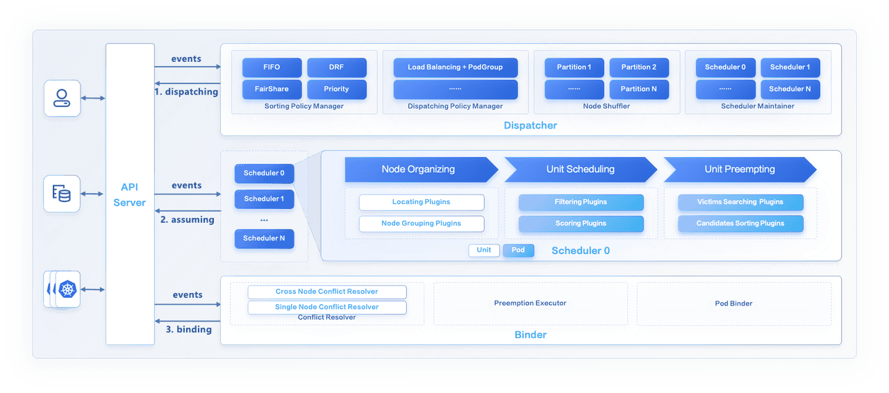
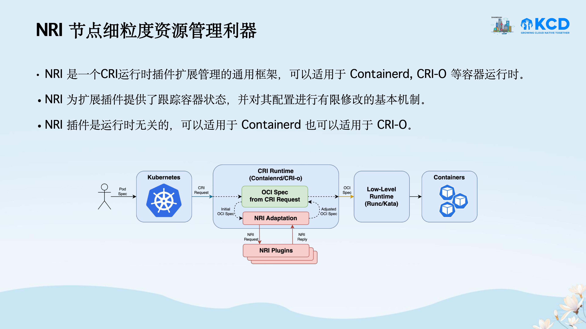
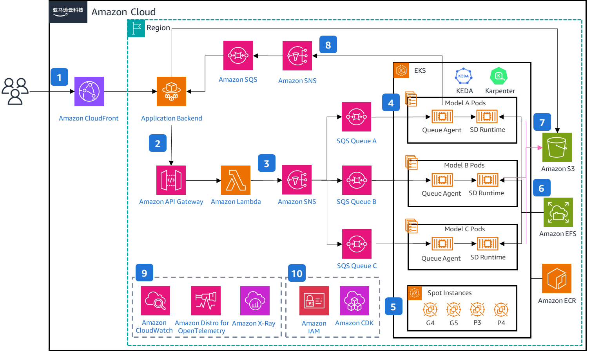
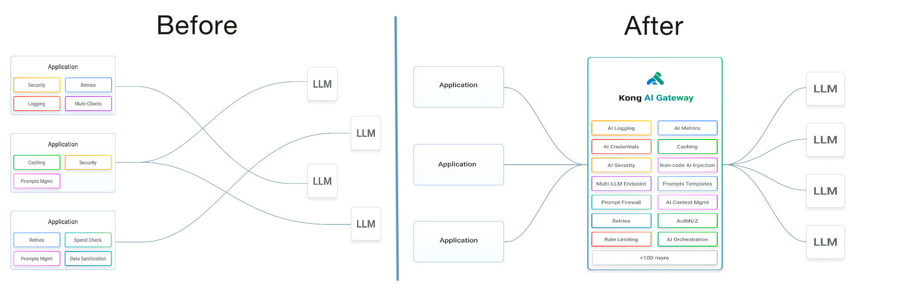
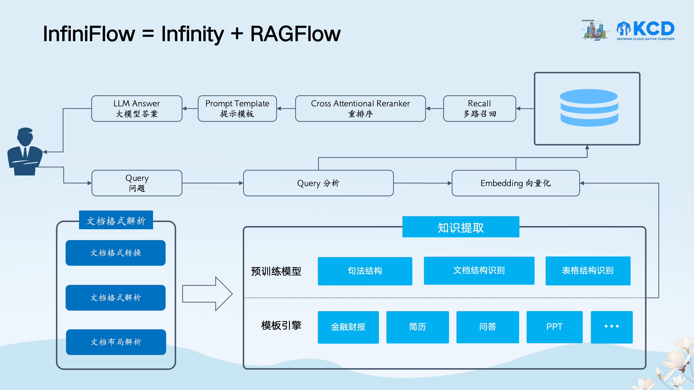

2024 年 4 月 20 日，Kubernetes Community Days Shanghai 2024 在上海举行。由于今年的 KubeCon China 会在 7 月份于香港举行，因此这次的活动某种意义上算是今年 KubeCon China 无法在上海举办的替代。在下文中，我将会对一些我现场观看的议题进行简单的介绍与梳理，主要包括 Kubernetes 调度与资源管理以及 LLM 相关的议题。

## Keynotes

### Godel Scheduler：字节开源内部超大规模在离线统一调度器 - 任玉泉，字节跳动



(Source: https://www.cncf.io/blog/2024/04/02/godel-scheduler-open-sourced-a-unified-scheduler-for-online-and-offline-workloads/)

演讲者为来自字节跳动的任玉泉，他主要介绍了字节跳动内部基于 Kubernetes 的大规模在离线统一调度系统 [Gödel](https://github.com/kubewharf/godel-scheduler)[^godel]。和先前维护 Kubernetes 与 YARN 两套在离线调度系统的方案相比，Gödel 基于统一的调度策略实现了在线与离线工作负载的统一调度，以期减少维护的成本并提高集群资源利用率。

Gödel 主要由以下三个组件组成：Dispatcher、Scheduler 与 Binder，其中：

- Dispatacher 作为调度生命周期的入口接收创建请求，基于一定的策略维护了优先级队列，并将请求分发给不同的调度器。
- Scheduler 负责接收来自 Dispatcher 的请求，并做出调度决策。Gödel 的调度器使用了类似 Google 的 Omega[^omega] 的共享状态机制，由多个调度器共享相同的调度视野，以获得相比于单体调度器更好的调度性能。
- Binder 使用乐观并发控制机制，将 Pod 绑定到调度器指定的节点上。

实际上我在演讲之前就已经通过他们团队先前在 SoCC 2023 Industry Track 发表的论文对 Gödel 有了一定的了解，当时我印象中这应该是 SoCC 第一次有 Industry Track 所以特别关注过。文章本身我认为是个不错的工程实践，我印象相当深的一点是，在实验评估中他们指出在 10000 个节点 1 秒钟提交 2800 个 Pod 的情况下，使用 Volcano 的 Kubernetes 集群的调度性能是相当灾难性的，仅为 12 Pods/s，与之相比 YARN 是 1000 Pods/s，Gödel 是 1950 Pods/s。

不过当初看到这篇文章的时候一个很自然的疑问就出现在了我的脑中，具体可以参见下文 [Katalyst 相关的总结](#基于-nri-实现精细化且可插拔的容器资源管理---曹贺字节跳动--任强intel)。

**相关仓库：**

- [kubewharf/godel-scheduler](https://github.com/kubewharf/godel-scheduler)

**相关文章：**

- [Gödel Scheduler open-sourced: a unified scheduler for online and offline workloads | CNCF](https://www.cncf.io/blog/2024/04/02/godel-scheduler-open-sourced-a-unified-scheduler-for-online-and-offline-workloads/)

**相关论文：**

- Wu Xiang, Yakun Li, Yuquan Ren, Fan Jiang, Chaohui Xin, Varun Gupta, Chao Xiang, Xinyi Song, Meng Liu, Bing Li, Kaiyang Shao, Chen Xu, Wei Shao, Yuqi Fu, Wilson Wang, Cong Xu, Wei Xu, Caixue Lin, Rui Shi, and Yuming Liang. 2023. Gödel: Unified Large-Scale Resource Management and Scheduling at ByteDance. In Proceedings of the 2023 ACM Symposium on Cloud Computing (SoCC '23). Association for Computing Machinery, New York, NY, USA, 308–323. https://doi.org/10.1145/3620678.3624663

## 云原生基础设施 & 操作系统

### 基于 NRI 实现精细化且可插拔的容器资源管理 - 曹贺，字节跳动 & 任强，Intel

两位演讲者分别是来自字节跳动的曹贺与来自 Intel 的任强，他们分别介绍了字节跳动开源的 Katalyst 以及其插件化的资源管理机制、CRI 扩展框架 NRI 以及 Katalyst 基于 NRI 的优化。

[NRI](https://github.com/containerd/nri) 是 [Containerd](https://github.com/containerd/containerd) 的子项目，一个 CRI 运行时插件扩展管理的通用框架，其允许用户自定义资源管理的插件，使得用户能够在容器的生命周期中对容器的配置进行一定程度的修改。

[Katalyst](https://github.com/kubewharf/katalyst-core) 是字节跳动所开源的细粒度资源管理与调度系统，有关 Katalyst 的介绍可参考我先前参加 KubeCon China 2023 时写的 [Recap](https://rudeigerc.dev/posts/kubecon-china-2023/)，演讲者同样是字节跳动的曹贺。在原先的设计中，Katalyst 在 Kubelet 中实现了 QoS Resource Manger（QRM）对 Kubelet 中自带的 CPU Manager 与 Memory Manager 进行了替换，以实现更细粒度的动态资源管理，并通过与 Topology Manager 集成实现了 NUMA 亲和的资源管理。然而，这种对 Kubelet 进行扩展的方式具有一定的侵入性，只能在使用 Kubewharf 发行版的 Kubernetes 集群中使用。



因此，Katalyst 基于 NRI 机制将 QRM 从 Kubelet 中解耦，提出了 Out-of-Band Resource Manager（ORM）（[kubewharf/katalyst-core#430](https://github.com/kubewharf/katalyst-core/issues/430)）。Katalyst 实现了 Katalyst Agent 作为 NRI Plugin 在节点上作为独立的进程运行，在其中实现了 Out-of-Band Resource Manager，复用了先前 QRM 框架中的部分插件，并通过 NRI 与容器运行时通信，实现动态的容器资源管理，与先前的实现机制相比具有更好的可扩展性与可插拔性。

值得一提的是，提问环节的时候，有位观众问了一个我想问的问题：

> Katalyst 与 Gödel 的关系是什么？如何在使用 Katalyst 的同时指定 Gödel 为调度器？

实际上我在看到 Gödel 的论文的时候就有这个疑问，虽然两者的出发点明显不同，Gödel 主要还是想整合 Kubernetes 和 YARN 的资源所以在上层抽象出了统一的调度结构，而 Katalyst 关注的是混部场景下的细粒度节点资源管理，但是无法回避的是两者的使用场景是有一定的重叠的，本质上都是针对复杂异构工作负载场景下大规模 Kubernetes 集群的资源管理与调度问题的框架。

在这个问题的回答中，演讲者提到了两者的关系是互补的，可以根据实际场景选择使用。听到这个回答我就明白了，这两者应该就是字节内部不同的团队的解决方案吧，当时就和一起听这个 Talk 的朋友不约而同地笑了出来。

**相关仓库：**

- [kubewharf/katalyst-core](https://github.com/kubewharf/katalyst-core)
- [containerd/nri](https://github.com/containerd/nri)
- [containers/nri-plugins](https://github.com/containers/nri-plugins)

**相关 KubeCon 演讲：**

- [Beyond Default: Harnessing CPU Affinity for Enhanced Performance Across Your Workload Portfolio - Antti Kervinen, Intel & Dixita Narang, Google LLC](https://kccnceu2024.sched.com/event/1YeMY), KubeCon EU 2024
- [Advancing Memory Management in Kubernetes: Next Steps with Memory QoS - Dixita Narang, Google & Antti Kervinen, Intel](https://kccncna2023.sched.com/event/1R2nL), KubeCon NA 2023
- [使用可插拔和可定制的智能运行时提升工作负载的QoS | Enhance Workload QoS with Pluggable and Customizable Smarter Runtimes - Rougang Han, Alibaba & Kang Zhang, Intel](https://kccncosschn2023.sched.com/event/1PTH5), KubeCon China 2023
- [NRI: Extending Containerd And CRI-O With Common Plugins - Krisztian Litkey, Intel & Mike Brown, IBM](https://kccncna2022.sched.com/event/182JT), KubeCon NA 2022
- [Maximizing Workload's Performance With Smarter Runtimes - Krisztian Litkey & Alexander Kanevskiy, Intel](https://kccnceu2021.sched.com/event/iE1Y), KubeCon EU 2021

## AI & Cloud

虽然这个分论坛的标题是 AI & Cloud，不过基本上可以说是 LLM 的 Session，大部分的演讲全部都是围绕 LLM 展开的，甚至有相当学院派的学术分享。

### 释放 Stable Diffusion 无限可能：基于 Kubernetes 的大规模部署最佳实践 - 于昺蛟，亚马逊云科技 & 郑予彬，亚马逊云科技



(Source: https://aws-samples.github.io/stable-diffusion-on-eks/en/implementation-guide/architecture/architecture/)

演讲者为来自亚马逊云科技的于昺蛟与郑予彬。演讲整体主要是在介绍如何基于 Amazon EKS 的生态系统来部署 Stable Diffusion 的解决方案，虽然使用了相当多的 AWS 的服务，不过整体架构都能在开源社区中找到对应的方案，因此我认为还是相当有参考价值的。我个人比较关注的是以下几点：

- 利用 [KEDA](https://github.com/kedacore/keda) 基于队列长度自动扩缩容器副本
- 利用 [Karpenter](https://github.com/kubernetes-sigs/karpenter) 自动扩缩实例
- 基于 [Bottlerocket](https://github.com/bottlerocket-os/bottlerocket) 实现容器镜像缓存（[Reduce container startup time on Amazon EKS with Bottlerocket data volume](https://aws.amazon.com/jp/blogs/containers/reduce-container-startup-time-on-amazon-eks-with-bottlerocket-data-volume/)）

KEDA 与 Karpenter 我先前都有一定的了解，KEDA 相比社区的 Horizontal Pod Autoscaler 具有更好的扩展能力，同时支持 Deployment 由零到一的扩缩容，而 Karpenter 也是相当成熟的节点自动扩缩容的项目，不过我个人比较少接触这种使用场景所以没有真正使用过。Bottlerocket 是我在此次演讲中第一次听说的项目，还有待更深入的了解，我了解过的一般针对镜像缓存与加速的解决方案似乎都是基于 [containerd/stargz-snapshotter](https://github.com/containerd/stargz-snapshotter) 或 [dragonflyoss/Dragonfly2](https://github.com/dragonflyoss/Dragonfly2) 的。

由于在这场演讲的时候我到达的比较晚，只听到了中后半段，让我印象相当深刻的是演讲者的演讲风格，真的很像在讲单口相声，我还是第一次在技术分享上看到这样的风格的分享，挺有意思的。

**相关仓库：**

- [aws-samples/stable-diffusion-on-eks](https://github.com/aws-samples/stable-diffusion-on-eks)
- [kedacore/keda](https://github.com/kedacore/keda)
- [kubernetes-sigs/karpenter](https://github.com/kubernetes-sigs/karpenter)
- [aws/karpenter-provider-aws](https://github.com/aws/karpenter-provider-aws)
- [bottlerocket-os/bottlerocket](https://github.com/bottlerocket-os/bottlerocket)

**相关文章：**

- [云端生成式 AI – 基于 Amazon EKS 的 Stable Diffusion 图像生成方案](https://aws.amazon.com/cn/blogs/china/stable-diffusion-image-generation-solution-based-on-amazon-eks/)

### 用 Operator 将 LLM 和 Gateway 结合的更容易 - 张晋涛，Kong Inc.



(Source: https://docs.konghq.com/gateway/latest/get-started/ai-gateway/)

演讲者为来自 Kong Inc. 的张晋涛。张晋涛首先介绍了调用 LLM 的 API 的时候存在的问题，包括安全性、成本、可靠性、可观测性与配额等多方面的问题，并以此引入了 AI Gateway 的概念。我认为 AI Gateway 本质上就是在正常的 Gateway 的基础上为其赋予了 LLM 相关的能力，这样就可以在利用传统 Gateway 本身优势的同时，也能够更好地支持 LLM 服务。此外，他还介绍了 Kong 所开源的 [Kong Gateway Operator](https://github.com/Kong/gateway-operator)，通过 CRD 以及 Kubernetes 的 Gateway API 以更加便利的形式管理 AI Gateway 的资源，更好地与 Kubernetes 的生态系统集成。

```yaml
apiVersion: gateway-operator.konghq.com/v1alpha1
kind: AIGateway
metadata:
  name: kong-aigateway
spec:
  gatewayClassName: kong-ai-gateways
  largeLanguageModels:
    cloudHosted:
      - identifier: marketing-team-classic-chatgpt
        model: gpt-3.5-turbo-instruct
        promptType: completions
        aiCloudProvider:
          name: openai
      - identifier: devteam-chatgpt
        model: gpt-4
        promptType: chat
        defaultPrompts:
          - role: system
            content: "You are a helpful assistant who responds in the style of Sherlock Holmes."
        defaultPromptParams:
          # temperature: "0.5" # higher confidence predictions
          maxTokens: 50 # shorter responses
          # topP: "0.9" # higher diversity
        aiCloudProvider:
          name: openai
  cloudProviderCredentials:
    name: acme-ai-cloud-providers
```

(Source: https://github.com/Kong/gateway-operator/blob/main/config/samples/aigateway.yaml)

近期我在公司内部部署 LLM 服务的时候也有遇到相似的问题（当然纯粹的内部服务的话有一些前文提及的问题是可以不必考虑的），
虽然目前也有如 [lm-sys/FastChat](https://github.com/lm-sys/FastChat) 这样的项目在应用层实现了简易的 Gateway 的功能，但是在 Kubernetes 生产环境中确实还是需要更加完善的解决方案，包括身份验证与授权的集成、可观测性的集成等，我认为 Kong 所给出的基于 Gateway 的解决方案是个相当不错的思路。

**相关仓库：**

- [Kong/kong](https://github.com/Kong/kong)
- [Kong/gateway-operator](https://github.com/Kong/gateway-operator)

### AI 原生数据库与 RAG - 张颖峰，InfiniFlow



演讲者为来自 InfiniFlow 的张颖峰，他首先介绍了基于向量数据库的 RAG 的工作流程，然后针对目前长上下文的 LLM 与 RAG 进行了对比，他认为：

> 不论 LLM“大海捞针”能力有多强，RAG 永远不可少，但不是当下的 RAG。

他指出目前 RAG 的主要挑战有以下三个：

1. 向量无法提供精确查询
2. 向量无法满足多样化查询需求
3. Garbage In, Garbage Out

因此，他们提出了 InfiniFlow，即 Infinity 与 RAGFlow 的组合，前者是 AI 原生数据库，后者是基于视觉模型和多样化模板的[文档理解](https://github.com/infiniflow/ragflow/blob/main/deepdoc/README.md)的 RAG 引擎，通过两者的组合可以提供更高质量的 RAG 服务解决方案。

实际上随着目前模型支持的上下文长度越来越大，RAG 的作用以及长上下文的 LLM 相关的论争也越来越激烈，有一部分观点认为 RAG 已死，在 LLM 本身就支持长上下文的情况下 RAG 只能提供相当有限的作用；另一部分观点认为长上下文的 LLM 仍然无法完全替代 RAG，本身还是具有一定的局限性，包括幻觉与可解释性等问题仍然无法解决。近期 NVIDIA 发表的一篇论文[^ruler]也表示实际上长上下文的模型的有效上下文范围很有可能没有模型本身声称的那么大，因此我认为这个问题还有待进一步的研究与讨论，不过我个人的观点也与演讲者相近，即使是在有长上下文模型的情况下，RAG 仍然是有其存在的价值的。

有关 RAG 与长上下文 LLM 的相关信息可以参考以下 LangChain 的工程师的 Slides：

- [Unifying RAG and long context LLMs](https://docs.google.com/presentation/d/1mJUiPBdtf58NfuSEQ7pVSEQ2Oqmek7F1i4gBwR6JDss/preview)

**相关仓库：**

- [infiniflow/infinity](https://github.com/infiniflow/infinity)
- [infiniflow/ragflow](https://github.com/infiniflow/ragflow)

## Summary

这次是我第一次参加 Kubernetes Community Days 的活动，与 KubeCon 不同，KCD 的演讲之间是没有休息的间隔的，整体的流程相当紧凑，因此留给观众提问的时间也有限，不过整体上我认为是一次挺有收获的活动，无论是 Kubernetes 本身还是 LLM 相关的议题也都给我带来一些新的思考。当然必须提及的是，由于举办的地点在字节跳动位于漕河泾的办公楼，所以附近吃的还是不少的，这点还是[比 KubeCon 要强不少](/posts/kubecon-china-2023/#summary)。

[[Slides]](https://github.com/cncf/presentations)
[[Videos]](https://space.bilibili.com/1274679632/channel/collectiondetail?sid=2842495)

[^godel]: Wu Xiang, Yakun Li, Yuquan Ren, Fan Jiang, Chaohui Xin, Varun Gupta, Chao Xiang, Xinyi Song, Meng Liu, Bing Li, Kaiyang Shao, Chen Xu, Wei Shao, Yuqi Fu, Wilson Wang, Cong Xu, Wei Xu, Caixue Lin, Rui Shi, and Yuming Liang. 2023. Gödel: Unified Large-Scale Resource Management and Scheduling at ByteDance. In Proceedings of the 2023 ACM Symposium on Cloud Computing (SoCC '23). Association for Computing Machinery, New York, NY, USA, 308–323. https://doi.org/10.1145/3620678.3624663

[^omega]: Malte Schwarzkopf, Andy Konwinski, Michael Abd-El-Malek, and John Wilkes. 2013. Omega: flexible, scalable schedulers for large compute clusters. In Proceedings of the 8th ACM European Conference on Computer Systems (EuroSys '13). Association for Computing Machinery, New York, NY, USA, 351–364. https://doi.org/10.1145/2465351.2465386

[^ruler]: Cheng-Ping Hsieh, Simeng Sun, Samuel Kriman, Shantanu Acharya, Dima Rekesh, Fei Jia, and Boris Ginsburg. 2024. RULER: What’s the Real Context Size of Your Long-Context Language Models?. http://arxiv.org/abs/2404.06654
