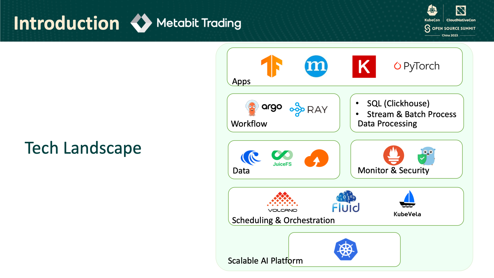
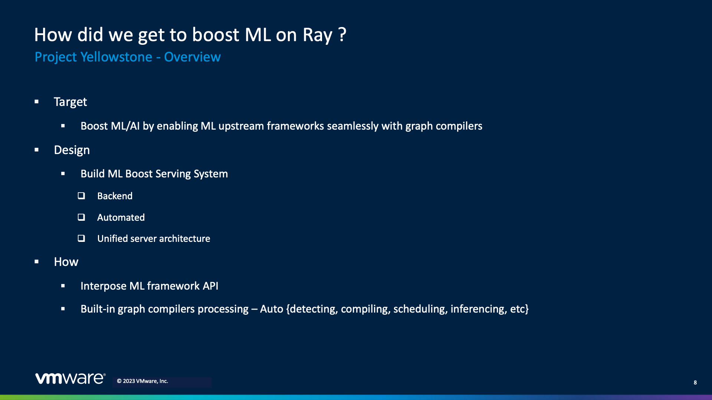
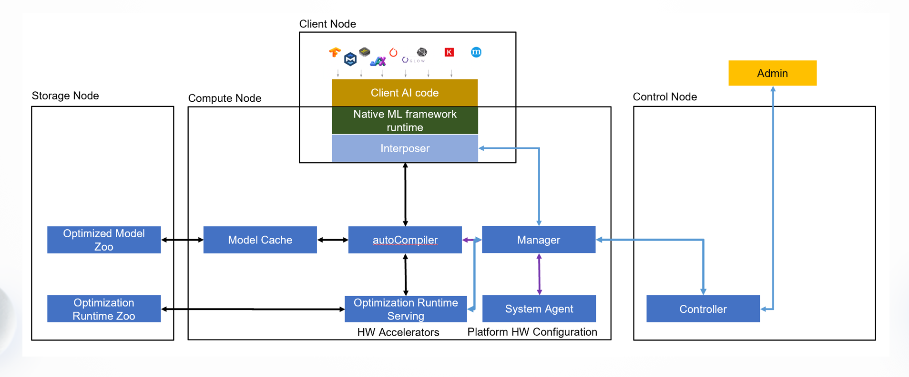
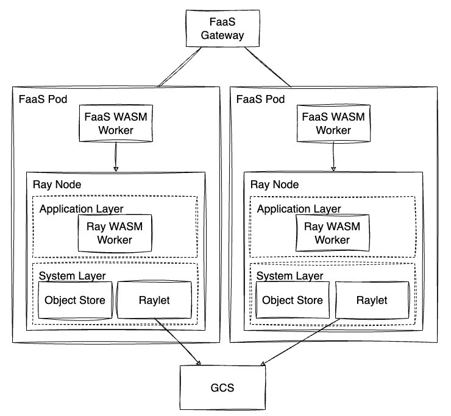
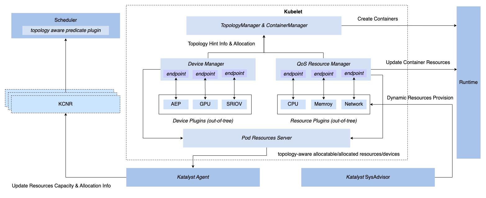
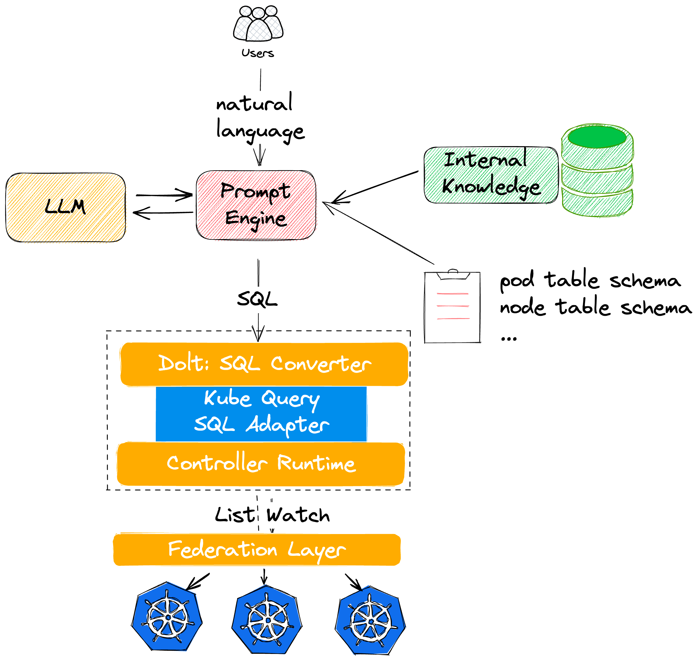

2023 年 9 月 26 日至 9 月 28 日，KubeCon + CloudNativeCon + Open Source Summit China 2023 时隔四年在上海线下召开。

近期我的工作主要集中在 AI Platform 的开发以及 Ray 与 Kubernetes 的集成，因此我选择去听的议题主要集中在 Platform Engineering 与 AI，以及 Ray Ecosystem 相关的 Topic，在接下来的部分我将会对一些现场观看的议题进行简单的介绍与梳理。

## Day 1

[使用KubeRay和Kueue在Kubernetes中托管Sailing Ray工作负载 | Sailing Ray Workloads with KubeRay and Kueue in Kubernetes - Jason Hu, Volcano Engine & Kante Yin, DaoCloud](https://kccncosschn2023.sched.com/event/1PTGw/zhi-kuberayrekueuenanokubernetesfa-sailing-raydu-zhe-sailing-ray-workloads-with-kuberay-and-kueue-in-kubernetes-jason-hu-volcano-engine-kante-yin-daocloud?iframe=no&w=100%&sidebar=yes&bg=no)

两位演讲者分别是来自字节跳动的火山引擎的 Jason Hu 与来自 DaoCloud 的 Kante Yin，他们分别介绍了 KubeRay 在字节跳动的应用与优化以及 KubeRay 与 Kueue 的集成。

[KubeRay](https://github.com/ray-project/kuberay) 是 Ray 团队所开源的 Kubernetes Operator，可通过对 Ray 相关的 CRD 的声明便利地将 Ray 集群部署到 Kubernetes 集群之上。目前 KubeRay 在行文的时间点还处于 1.0 RC 的阶段，但是在 Beta 版本时期就已经有许多公司在生产环境中使用了，如 [Spotify](https://engineering.atspotify.com/2023/02/unleashing-ml-innovation-at-spotify-with-ray/) 与 [Shopify](https://shopify.engineering/merlin-shopify-machine-learning-platform) 等，也因此字节跳动内部也基于 KubeRay 针对内部的工作负载进行了一定程度的优化，演讲者对这些优化进行了简单的介绍。

[Kueue](https://github.com/kubernetes-sigs/kueue) 是一个 Kubernetes 原生的作业队列系统，它的目标是与 Kubernetes 内置的 Scheduler、Job Controller 等组件集成，并形成一个端到端的作业管理的解决方案，而不是去替换掉前述的这些组件的功能。实际上 Kueue 在设计初期的时候我就有在关注，与 Volcano（kube-batch）和 Yunikorn 这些已有的针对批处理作业的调度系统相比，Kueue 的设计理念更加贴近于 Kubernetes 的原生设计，而且提供了更加细粒度的多租户弹性配额机制。

当然不可否认的是从集群资源管理的角度而言实际上 Kueue 与 Volcano 的职能实际上还是有一些重叠的，目前包括 KubeRay 在内的很多大数据与机器学习框架的 Operator 都为与 Volcano 的集成提供了第一方的支持，因此如何吸引用户切换到 Kueue 我认为还有很长的一段路要走。如果读者有兴趣的话可以访问 [Kueue 的设计文档](https://docs.google.com/document/d/1jFdQPlGnvjCSOrtAFxzGxEMi9z-OS0VVD1uTfSGHXts/preview) 以及 Google Cloud 的 Tutorial [使用 Kueue 部署批处理系统](https://cloud.google.com/kubernetes-engine/docs/tutorials/kueue-intro?hl=zh-cn) 对 Kueue 更深入地了解。

由于 KubeRay 和 Kueue 两者我先前都有基本的了解，所以原先希望能够听到更加深入的内容，但是实际上两部分的内容都比较偏向于介绍性质，这一点就我个人来说还是比较可惜。

**相关仓库：**

- [ray-project/kuberay](https://github.com/ray-project/kuberay)
- [kubernetes-sigs/kueue](https://github.com/kubernetes-sigs/kueue)

---

[从零到无穷大：如何基于AI技术的对冲基金在Kubernetes上构建云原生AI平台 | From Zero to Infinity：How AI-Powered Hedge Fund Build Cloud-Native AI Platform on Kubernetes - Yang Che, Alibaba Cloud & Zhiyi Li, Metabit Trading](https://kccncosschn2023.sched.com/event/1PTGM/xi-xin-daep27daizha-27dshu-nanokubernetes-chang-ai-from-zero-to-infinitydaephow-ai-powered-hedge-fund-build-cloud-native-ai-platform-on-kubernetes-yang-che-alibaba-cloud-zhiyi-li-metabit-trading?iframe=no&w=100%&sidebar=yes&bg=no)

两位演讲者主要分别是来自阿里云的 Yang Che 与来自乾象投资的 Zhiyi Li，他们介绍了如何利用 Fluid 与 JuiceFS 构建弹性分布式缓存解决方案，以面对突发的工作负载的变化。

[JuiceFS](juicedata/juicefs) 是一个面向云原生设计的高性能分布式文件系统，其采用将数据与元数据分离的架构，从而实现文件系统的分布式设计。
乾象投资选择 JuiceFS 作为底层的存储，他们的工作负载会与研究员本身的任务有强烈的关联性，所以可能会产生突发的工作负载的变化，这个变化可能高达千倍。
因此除了存储本身，他们还需要一个能够提供数据编排与缓存管理的解决方案。

[Fluid](fluid-cloudnative/fluid) 是一个开源的 Kubernetes 原生的分布式数据集编排和加速引擎，该项目起源于南京大学的 PASALab，由国内的高校发起并且最终形成比较成熟的开源社区的项目还是挺少见的，虽然应该阿里云也有一定程度上的参与，但是我认为也是个很有意义的尝试。回归项目本身，Fluid 通过分布式缓存以及亲和性调度为加速数据访问提供了良好的优化，对 AI 和大数据的工作负载提供弹性的计算资源和数据吞吐的支持，能够有效地减少训练过程中所消耗的时间从而减少企业在云平台上的成本。

由于该议题的演讲者与笔者同样来自于量化公司，我认为同为量化公司的使用场景应该相当类似，所以希望能从演讲中参考借鉴一些解决方案，而我先前也比较少关注在存储相关的优化上，希望有机会能再多多交流。

JuiceFS 官方也有博客介绍其它采用 Fluid 与 JuiceFS 的解决方案，详见[如何在 Kubernetes 集群中玩转 Fluid + JuiceFS](https://juicefs.com/zh-cn/blog/solutions/fluid-with-juicefs) 与 JuiceFS Cloud 的[在 Fluid 中使用 JuiceFS](https://juicefs.com/docs/zh/cloud/kubernetes/fluid/)。

**相关仓库：**

- [juicedata/juicefs](https://github.com/juicedata/juicefs)
- [fluid-cloudnative/fluid](https://github.com/fluid-cloudnative/fluid)

**相关论文：**

- Rong Gu, Kai Zhang, Zhihao Xu, Yang Che, Bin Fan, Haojun Hou, Haipeng Dai, Li Yi, Yu Ding, Guihai Chen, and Yihua Huang. 2022. Fluid: Dataset Abstraction and Elastic Acceleration for Cloud-native Deep Learning Training Jobs. In 2022 IEEE 38th International Conference on Data Engineering (ICDE), IEEE, Kuala Lumpur, Malaysia, 2182–2195. DOI:https://doi.org/10.1109/ICDE53745.2022.00209

---

[在k8s上使用Ray对异构AI加速器进行ML增强 | Boost ML on Heterogeneous AI Accelerator with Ray on K8s - Tiejun Chen, VMware](https://kccncosschn2023.sched.com/event/1PTF9/nanok8szhi-rayai-fu-jmao-chan-ml-boost-ml-on-heterogeneous-ai-accelerator-with-ray-on-k8s-tiejun-chen-vmware?iframe=yes&w=100%&sidebar=yes&bg=no)

演讲者是来自 VMware OCTO 的 Tiejun Chen。他首先介绍了目前现代化的 AI 应用平台存在的问题，主要包括以下几点：

- 异构的 AI 硬件加速器
- 多样的上游机器学习框架
- 难以达到最佳的性能
- 没有一个云原生且现代化的 AI 平台

演讲者提出了 Project Yellowstone，其目标在于搭建基于 Kubernetes 的从云到边缘的端到端机器学习服务。

Yellowstone 提供了一个 Runtime Interposer 作为抽象层衔接机器学习框架（如 Tensorflow）与图优化框架（如 Apache TVM），无缝地介入用户的代码，从而实现对不同的编译器后端的支持。

Yellowstone 的思路其实挺直观的，本质上就是加了一层抽象屏蔽了编译器后端以及硬件加速器并为用户提供了统一的接口访问，也是很经典的基于 Kubernetes 的设计模式。有关 Yellowstone 目前可以搜索到的消息比较少，笔者也仅在 VMware OCTO 的一篇博客 [Let’s Go Over the Edge: What’s Next for VMware Edge Compute](https://octo.vmware.com/vmware-edge-compute-whats-next/) 内有看到相关内容，期待后续项目的发展。演讲者先前也在 Ray Forward 2023 上分享了相同的内容，感兴趣的读者可以先行观看[在 Ray 上无缝使能异构 AI 加速器到主流 ML 框架提升机器学习](https://www.bilibili.com/video/BV1VV411M7jh)。

**相关仓库：**

- [ray-project/ray](https://github.com/ray-project/ray)
- [apache/tvm](https://github.com/apache/tvm)

## Day 2

[基于WebAssembly的FaaS框架，具备分布式机器学习能力 | WebAssembly-Based FaaS Framework with Distributed Machine Learning Capabilities - Wilson Wang, ByteDance & Michael Yuan, Second State](https://kccncosschn2023.sched.com/event/1PTF3/27dwebassemblyzha-faasdaelsjxia-webassembly-based-faas-framework-with-distributed-machine-learning-capabilities-wilson-wang-bytedance-michael-yuan-second-state?iframe=yes&w=100%&sidebar=yes&bg=no)

演讲者为来自字节跳动的 Wilson Wang，来自 Second State 的 Michael Yuan 因故缺席。Wilson Song 由软件架构的发展展开，指出目前的软件架构（Monolithic/SOA/Microservice/Serverless）存在的问题，期望能够得到一个在 FaaS 环境中下一代云应用开发的解决方案。演讲者认为 VM、Container 与 Unikernel 这些已有的方案都无法满足他的需求，具体而言，VM 与 Container 无论如何优化在启动时间上与 Unikernal 都有数量级上的差距，而 Unikernel 对不同平台的兼容性较差，同时对并行执行的支持有限而且难以 Debug。因此演讲者最终选择了 WebAssembly 作为解决方案，WebAssembly 具有较低的开销并且易于兼容不同的硬件与操作系统，此外 WebAssembly 社区也有 [wasi-nn](https://github.com/WebAssembly/wasi-nn) 插件支持不同硬件进行机器学习的推理。另一方面，演讲者也引入 Ray 作为其底层的分布式计算引擎。

以 WebAssembly 和 Ray 作为基础，演讲者提出了 Warrior，一个基于 WebAssembly 的 FaaS 框架。Warrior 使用 WasmEdge 自定义了 Ray 的 Worker，这样既支持了 WebAssembly Runtime 也可以利用 Ray 的分布式计算的能力，大部分已有的 FaaS 框架在进行一定的修改之后也能便利地与 Warrior 集成。

可以看出演讲者本身有相当宏大的愿景，但是项目本身很明显属于探索性质比较强烈的项目，短时间内应该不大可能在生产环境当中使用，而且对 FaaS 框架与 Ray 本身也有一定的侵入性，后续这个项目将如何推动和发展也值得关注。

**相关仓库：**

- [ServiceWeaver/weaver](https://github.com/ServiceWeaver/weaver)
- [WebAssembly/wasi-nn](https://github.com/WebAssembly/wasi-nn)
- [WasmEdge/WasmEdge](https://github.com/WasmEdge/WasmEdge)
- [ray-project/ray](https://github.com/ray-project/ray)

**相关论文：**

- Sanjay Ghemawat, Robert Grandl, Srdjan Petrovic, Michael Whittaker, Parveen Patel, Ivan Posva, and Amin Vahdat. 2023. Towards Modern Development of Cloud Applications. In Proceedings of the 19th Workshop on Hot Topics in Operating Systems (HOTOS '23). Association for Computing Machinery, New York, NY, USA, 110–117. https://doi.org/10.1145/3593856.3595909
- Simon Shillaker and Peter Pietzuch. 2020. Faasm: Lightweight isolation for efficient stateful serverless computing. In 2020 USENIX annual technical conference (USENIX ATC 20), USENIX Association, 419–433. https://www.usenix.org/conference/atc20/presentation/shillaker

---

[在Kubernetes上构建一个精细化和智能化的资源管理系统 | Building a Fine-Grained and Intelligent Resource Management System on Kubernetes - He Cao & Wei Shao, ByteDance](https://kccncosschn2023.sched.com/event/1RSk1/nanokubernetesken-yong-rexia-zha-pian-fa-lia-xu-ni-building-a-fine-grained-and-intelligent-resource-management-system-on-kubernetes-he-cao-wei-shao-bytedance?iframe=yes&w=100%&sidebar=yes&bg=no)

两位演讲者分别是来自字节跳动的 He Cao 与 Wei Shao，他们介绍了字节跳动开源的细粒度资源管理与调度系统 [Katalyst](https://github.com/kubewharf/katalyst-core)。

他们详细介绍了 Katalyst 的以下几个使用场景：

- 混部
  - 基于 Kubernetes 原有的三种 QoS 级别进行扩展
  - 通过 Kubelet Hook 的方式对 Kubelet 进行扩展（QoS Resource Manager）
  - 基于 [PID Algorithm](https://en.wikipedia.org/wiki/Proportional%E2%80%93integral%E2%80%93derivative_controller) 的资源预测算法
  - 多维度（CPU/Memory/SSD/Network）的资源隔离机制
  - 面向 SRE 的多层级（Cluster/Node Pool/Node/Service）动态配置
- 共享 GPU 调度（GPUShare Plugin）
- 拓扑感知的调度（RDMA 的亲和性）
- 资源效率套件

其中*共享 GPU 调度*与*拓扑感知的调度*的部分将会由 He Cao 在 CNCF-hosted Co-located Events North America 2023 上进行更详细的分享（[Improving GPU Utilization and Accelerating Model Training with Scheduling Framework and NRI - He Cao, ByteDance](https://colocatedeventsna2023.sched.com/event/1Rj4O)）。

Katalyst 很明显是想做成一个 All-in-One 的资源管理与调度框架，对标的应该就是阿里云先前开源的 Koordinator，不过在开源社区的治理上看上去还是有着不小的差距。
对于平台开发者而言，Katalyst 的一些设计我觉得在实现企业内部的资源管理框架的时候有很大的参考价值，包括在混部场景下基于自定义 QoS 级别对资源管理的扩展与相应的调度器的扩展等。
对于用户而言，我认为还是要根据自身的工作负载来决定要使用哪些策略才会有较好的优化效果，是否真的需要采用这种 All-in-One 的调度系统还需要 Case-by-Case 地讨论。

**相关仓库：**

- [kubewharf/katalyst-core](https://github.com/kubewharf/katalyst-core)

---

[忘记kubectl，与您的集群交流：使用LLMs简化Kubernetes集群管理 | Forget Kubectl and Talk to Your Clusters: Using LLMs to Simplify Kubernetes Cluster Management - Qian Ding, Ant Group](https://kccncosschn2023.sched.com/event/1PTJM/ping-kubectldaelszha-zhong-shi-daepzhi-llmshu-kuberneteszhong-shi-fa-lia-forget-kubectl-and-talk-to-your-clusters-using-llms-to-simplify-kubernetes-cluster-management-qian-ding-ant-group?iframe=yes&w=100%&sidebar=yes&bg=no)

演讲者 Qian Ding 是蚂蚁集团的 Staff SRE，也是我在蚂蚁集团实习时候的 Leader。项目本身的出发点在于如何利用 LLM 来辅助 troubleshooting，目标是将*非结构化数据的自然语言转换成面向 API 的结构化数据*。最初他们尝试自行训练 LLM，并通过模板化的 Prompt 将自然语言转换成特定的参数并通过 Kubernetes 的 API 完成相应的操作，但是面临一些更复杂的条件查询的情况时，前述方案就会失效，实际上也会存在权限管理上的隐患。因此，最终他们将目标缩小到如何将自然语言转换成形如 `kubectl get` 的操作。

在 trial and error 之后，最终演讲者采用的方案就如上图所示。受到 [eosphoros-ai/DB-GPT](https://github.com/eosphoros-ai/DB-GPT) 的启发，演讲者引入了 Kube Query SQL Adapter，一个将 SQL 语句转换为操作 Kubernetes Controller Runtime 的指令的工具。用户通过自然语言交互后，Prompt Engine 通过先验知识以及与 LLM 交互将自然语言转换成 SQL 的查询语句，并通过前述的 Kube Query 将 SQL 语句转换成相应的查询操作，最终将结果返回给用户。

LLM 与其它领域的结合一直是近期的热点，实际上在 KubeCon 一开始的 Keynote 当中，有些与 LLM 关联性并不是特别强的 Topic 也在有意识地朝着 LLM 靠拢。生成式 AI 的高速发展在各个领域都颇具争议性，作为软件工程师，我们要如何合理地利用这股热潮提高我们自身的工作效率，我认为是个有趣的话题。举例来说，在代码编写的过程中使用 GitHub Copilot 辅助以及寻求 ChatGPT 的帮助已经是个司空见惯的操作（实际上甚至在本文的行文的过程笔者就受惠于 Copilot 数次）。另一方面，很多文档类的网站也都引入了 Chat AI Bot 辅助用户去进行搜索（如 Grafana Docs 的 Grot），之前在和同事交流的过程中，也有同事提到过如果我们能够自行训练一个 LLM 辅助我们进行用户的答疑的话，是不是能节省很多我们原先耗费在这之上的时间。我认为这个演讲给我们提供了一个很好的切入点，希望在后续能够有机会去尝试一下。

## Summary

今年是我第三次在线下参加 KubeCon，也是我成为社会人之后的第一次，很感谢公司能给我提供这个机会，希望下次能和其他几位相关的同事一起来参会，当然如果有机会的话能自己提交提案的话就更好了。虽然今年相比上次场地有所缩水，不过整体上来说还是挺有意思的，难得见到了不少许久未见的朋友，也有机会和几位新的朋友进行简单的交流。当然需要强调的是，午餐还是一如既往地难吃，以及晚餐依旧抢不到。

如果读者对其它的议题感兴趣的话可以访问这次会议的[日程安排](https://www.lfasiallc.com/kubecon-cloudnativecon-open-source-summit-china/program/schedule/)，大部分的议题演讲者都有上传他们的 Slides，演讲的录播应该在一段时间之后也会被上传到 [CNCF 的 YouTube Channel](https://www.youtube.com/c/cloudnativefdn) 上。

除了前文提及的议题之外，其它也有一些我个人感兴趣但是因为时间冲突或是其它因素没有成行的议题，希望在后续录像放出的时候能够再进行回顾。

- [教程: 一个关于在Kubernetes周围的CNCF/OSS可观测性解决方案的搭车者指南 | Tutorial: A Hitchhiker's Guide to CNCF/OSS Observability Solutions Around Kubernetes - Matthias Haeussler, Novatec Consulting & Tiffany Jernigan, VMware](https://kccncosschn2023.sched.com/event/1PTII/xiao-nanokubernetestoyuzha-cncfossqi-ji-zha-wu-ke-tutorial-a-hitchhikers-guide-to-cncfoss-observability-solutions-around-kubernetes-matthias-haeussler-novatec-consulting-tiffany-jernigan-vmware?iframe=yes&w=100%&sidebar=yes&bg=no)
- [使用Volcano更轻松高效地在Kubernetes上运行您的AI工作负载和微服务 | Run Your AI Workloads and Microservices on Kubernetes More Easily and Efficiently with Volcano - William Wang, Huawei Cloud](https://kccncosschn2023.sched.com/event/1PTKW/zhi-volcanosi-pan-piconanokubernetesai-chan-zha-aidu-zhe-re-run-your-ai-workloads-and-microservices-on-kubernetes-more-easily-and-efficiently-with-volcano-william-wang-huawei-cloud?iframe=yes&w=100%&sidebar=yes&bg=no)
- [如何加速模型训练并消除云计算中的I/O瓶颈 | How to Accelerate Model Training and Eliminate the I/O bottleneck for the Cloud - Rui Su, Juicedata](https://kccncosschn2023.sched.com/event/1RSee/fu-nfxiao-zhen-mang-dou-zhao-zha-iomin-ao-how-to-accelerate-model-training-and-eliminate-the-io-bottleneck-for-the-cloud-rui-su-juicedata?iframe=yes&w=100%&sidebar=yes&bg=no)
- [如何使用集群自动缩放器将批处理作业的节点扩展到2k个节点 | How We Scale up to 2k Nodes for Batch Jobs Using Cluster Autoscaler - Lei Qian, ByteDance](https://kccncosschn2023.sched.com/event/1PTH8/zhi-zhong-shi-kek-yu-jlia-zha-ze-2kze-how-we-scale-up-to-2k-nodes-for-batch-jobs-using-cluster-autoscaler-lei-qian-bytedance?iframe=yes&w=100%&sidebar=yes&bg=no)
- [在Kubernetes生产环境中的容器实时迁移 | Container Live Migration in Kubernetes Production Environment - Yenan Lang and Hua Liu, Tencent](https://kccncosschn2023.sched.com/event/1RT6O/nanokuberneteschang-hou-zha-jhui-zhe-container-live-migration-in-kubernetes-production-environment-yenan-lang-and-hua-liu-tencent?iframe=yes&w=100%&sidebar=yes&bg=no)
- [如何在大型集群中加速 Pod 的启动？ | How Can Pod Start-up Be Accelerated on Nodes in Large Clusters? - Paco Xu, DaoCloud & Byron Wang, Birentech](https://kccncosschn2023.sched.com/event/1PTFR/nanonfzhong-shi-fu-pod-zha-dyags-how-can-pod-start-up-be-accelerated-on-nodes-in-large-clusters-paco-xu-daocloud-byron-wang-birentech?iframe=yes&w=100%&sidebar=yes&bg=no)

[^serviceweaver]: Sanjay Ghemawat, Robert Grandl, Srdjan Petrovic, Michael Whittaker, Parveen Patel, Ivan Posva, and Amin Vahdat. 2023. Towards Modern Development of Cloud Applications. In Proceedings of the 19th Workshop on Hot Topics in Operating Systems (HOTOS '23). Association for Computing Machinery, New York, NY, USA, 110–117. https://doi.org/10.1145/3593856.3595909
[^faasm]: Shillaker, S. and Pietzuch, P. 2020. Faasm: Lightweight isolation for efficient stateful serverless computing. 2020 USENIX annual technical conference (USENIX ATC 20) (Jul. 2020), 419–433.
