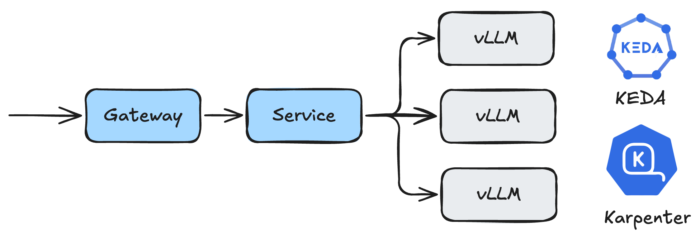
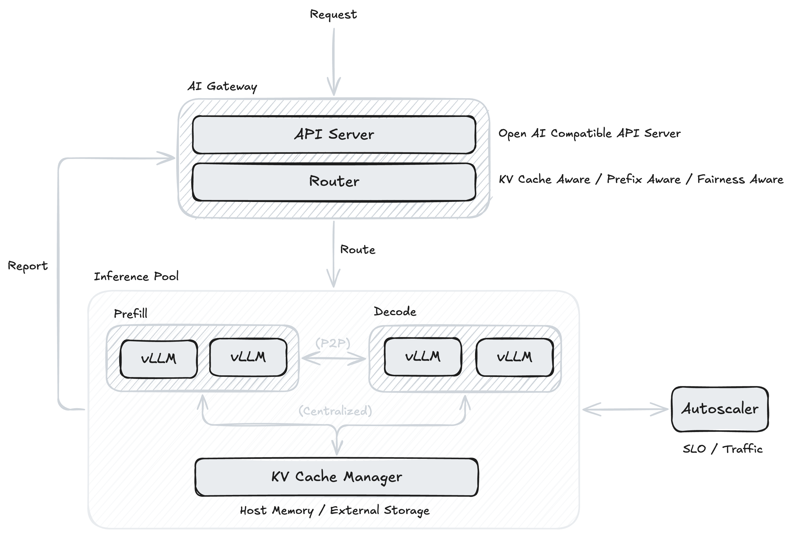

> This post is the English transcript of my previous post. You can also read the [Chinese version](https://mp.weixin.qq.com/s/5Q2Rjg6YKs7V9kOL41eACQ) of this post on WeChat.

## Introduction

As Large Language Models (LLMs) become widely deployed in production environments, efficient inference deployment has become a core challenge facing the industry. To address this challenge, both industry and academia are actively exploring various optimization solutions, including:

- **Multi-dimensional parallelism techniques:** Data Parallelism, Tensor Parallelism, Pipeline Parallelism, Expert Parallelism, etc.
- **Batch processing optimization:** Continuous Batching

These technologies have significant optimization effects on LLM inference performance. However, with the continuous growth of model scale and the complexity of application scenarios, traditional single-machine deployment methods are no longer applicable, especially with the emergence of large-scale MoE (Mixture of Experts) models such as DeepSeek V3/R1 and Kimi K2. The compute resource requirements of these models have exceeded the capacity of single machines, resulting in new challenges for LLM inference.

In this post, we will introduce the architecture of Kubernetes-based large language model distributed inference frameworks, including the current mainstream distributed inference solutions in the Kubernetes community and their integration of related academic work, aiming to share the problems solved by current mainstream Kubernetes-based solutions and possible future development directions.

**Please note that this post mainly focuses on the orchestration layer architectural design and does not involve specific optimization implementations within inference engines like vLLM and SGLang.**

## Background

Before introducing Kubernetes-based LLM distributed inference frameworks, we need to have a preliminary understanding of the LLM inference process.

### LLM Inference

#### Prefill and Decode

The inference of Transformer-based LLMs is mainly divided into two phases: **Prefill** and **Decode**.

- **Prefill**: The prefill phase is the first step of the inference process. Its core task is to process the input prompts. In this phase, the model processes all tokens in the input prompt in parallel, computing the attention states of the entire input sequence at once. This process generates a set of key intermediate results, namely *key* and *value*, and stores them in the KV Cache. Since the prefill phase involves extensive matrix multiplication operations on the entire input sequence, it is a **compute-bound** process.

- **Decode**: When the prefill phase is complete and generates the initial KV Cache, the process enters the decode phase and begins generating output tokens one by one. This is an auto-regressive process, meaning that for each newly generated token, it needs to be used as input along with all previous context (including the original prompt and generated tokens) to predict the next token. Unlike prefill, the decode phase is serial and cannot be processed in parallel. When generating each token, the main performance bottleneck lies in loading and reading massive model weight parameters from HBM, making this a **memory-bound** process.

### Metrics for LLM Inference

This section introduces key metrics for measuring LLM inference performance across different optimization scenarios:

**Latency Metrics:**

- **Time to First Token (TTFT)**: The time required to generate the first token after a request arrives, which is a metric for measuring prefill phase performance.
- **Time Per Output Token (TPOT)**: The average time required to generate one output token, which is a metric for measuring decode phase performance.
- **Latency (E2E Latency)**: End-to-end latency. `latency = TTFT + TPOT × number of tokens`

**Throughput Metrics:**

- **Throughput (Tokens Per Second)**: The number of tokens generated per unit time, i.e., end-to-end throughput.
- **Requests per second (RPS)**: The number of successful requests per unit time.

In addition to the aforementioned common metrics widely used, there are some additional metrics, such as:

- **Normalized Time Per Output Token (NTPOT)**: Normalized TPOT, calculated as NTPOT = latency / number of tokens.
- **Inter-Token Latency (ITL)**: The latency between two token generations, differing from TPOT in that it measures the discrete values of time between token generations.

## Review: Single-Machine LLM Deployment on Kubernetes

The diagram shows a common solution for deploying vLLM-based single-machine inference services in Kubernetes clusters, with autoscaling based on [KEDA](https://keda.sh/) (Pod-level autoscaling) and [Karpenter](https://karpenter.sh/) (node-level autoscaling), and Gateway handling routing and load balancing at the gateway level. This was the mainstream solution for deploying LLMs at the time. The models then required only a single machine with multi-GPU to meet inference needs, while multi-machine, multi-GPU deployment based on vLLM and Ray would cause significant performance degradation in decode phase tensor parallelism due to network infrastructure differences and limitations (such as network bandwidth becoming a performance bottleneck on 10Gbps Ethernet infrastructure). Therefore, adopting the aforementioned solution was actually a relatively reasonable choice, allowing the use of multi-dimensional autoscaling mechanisms to control deployment scale based on traffic to achieve better inference performance.

However, with the emergence of MoE architecture models such as DeepSeek V3/R1 and Kimi K2, the deployment architecture mentioned above faces challenges. Larger parameters and sequence lengths, along with more complex usage scenarios, make single-machine GPU deployment methods no longer applicable. Communication inter and intra nodeswith different parallelism methods (depending on network topology) introduces non-negligible latency, causing significant degradation in multiple key metrics and affecting inference service quality.

Therefore, engineers are turning to distributed inference. Kubernetes-based distributed inference solutions have experienced rapid development from late 2024 to the present, with major companies open-sourcing their proposed solutions in the community. How to utilize cluster orchestration capabilities to enable underlying inference frameworks to achieve better performance, such as service quality improvement and cost reduction, are goals that distributed inference frameworks need to achieve. The following text will provide an overall introduction to Kubernetes-based LLM distributed inference frameworks and how these frameworks organically combine industry experience with academic achievements to realize more efficient LLM inference.

## Kubernetes-based LLM Distributed Inference Frameworks

Currently, the main Kubernetes-based LLM distributed inference frameworks or solutions in the open-source community include:

- [AIBrix](https://aibrix.readthedocs.io/) (vLLM / ByteDance)
- [Dynamo](https://developer.nvidia.com/dynamo) (NVIDIA)
- [llm-d](https://llm-d.ai/) (Red Hat / Google / IBM)
- [OME](https://github.com/sgl-project/ome) (SGLang / Oracle)

Although the aforementioned projects are led by different companies, their focus points are similar. The diagram shows a relatively universal overview of LLM-based distributed inference frameworks, mainly consisting of the following components:

- **AI Gateway**: Provides OpenAI API-compatible interface API Server and Router responsible for request routing.
- **Inference Pool**: Responsible for workload deployment.
- **Autoscaler**: Responsible for autoscaling of workload nodes.

Currently, Kubernetes-based distributed inference frameworks mainly focus on the following topics, which will be introduced separately below:

- PD Disaggregation
- Load Balancing
- KV Cache Management
- Auto-scaling

### Prefill-Decode Disaggregation

The process of LLM inference is divided into two phases, where prefill is compute-intensive and decode is memory-intensive, with completely different resource requirements. Generally, LLM inference engines adopt continuous batching to aggregate multiple requests for processing, which creates serious resource conflicts and efficiency bottlenecks. When executing compute-intensive prefill tasks, the system cannot simultaneously satisfy the high-frequency memory bandwidth requirements of decode tasks. On the other hand, when executing memory-intensive decode tasks, large amounts of computational resources remain idle. Additionally, this mixed execution mode causes blocking, where a compute-heavy prefill request blocks many subsequent decode steps that could be completed quickly, increasing waiting latency for other users and preventing continuous batching advantages from being fully utilized.

PD Disaggregation (Prefill-Decode Disaggregation) is precisely an architectural optimization solution proposed to solve the above problems. This technology was initially proposed by academic works like Splitwise and DistServe. The core idea is to physically separate the prefill and decode phases, running them on different worker nodes. Engineers could adjust resource configurations for both types of services based on their respective resource usage characteristics to optimize different key metrics while avoiding mutual interference between the two phases' workloads. Additionally, in specific work scenarios, heterogeneous hardware resources can even be applied to run prefill and decode workloads separately, making optimized use of different computational resource capabilities.

However, **PD disaggregation is not a silver bullet**. With PD disaggregation architecture, KV Cache from the prefill phase needs to be transmitted to the decode phase, introducing additional data transmission overhead. Considering the size of KV Cache, frequent data transmission between different services may bring significant latency, potentially offsetting the performance improvements brought by PD disaggregation. Additionally, PD disaggregation requires additional orchestration and scheduling logic to manage collaboration between prefill and decode services, as well as inter-service KV Cache management, significantly increasing system complexity. Therefore, PD disaggregation is more suitable for large-scale deployment inference scenarios, especially when requests are sufficiently heterogeneous (i.e., request patterns and resource requirements are highly differentiated), bringing better benefits. In edge scenarios like embodied intelligence, the benefits introduced may be limited or even negative. Currently, projects like AIBrix, Dynamo, and llm-d all provide PD disaggregation support based on different implementations of inference engines.

### Routing and Load Balancing

In distributed inference scenarios, the Gateway needs to forward user requests to specific instances, which are model replicas running on different GPUs or server nodes. However, LLM load balancing is more complex than traditional stateless services, with core challenges stemming from the statefulness and heterogeneity of the inference process itself. The core of LLM inference is KV Cache, which stores keys and values computed by the model during the Prefill phase. Since various requests' prompts may have overlapping prefixes, the shared prefixes can be reused by multiple requests, significantly improving inference efficiency. Therefore, load balancing needs to consider how to efficiently utilize these caches rather than simply randomly distributing requests to different instances. Projects like Dynamo and AIBrix extend load balancing functionality through plugin-based approaches, supporting flexible configuration of multiple load balancing algorithms at the gateway level.

#### Prefix-Aware

Prefix Caching is a technique that can cache and reuse KV Cache from request prefix portions. When multiple requests share the same prefix, the system can avoid repeated computation by directly reusing cached Keys and Values, significantly reducing TTFT and improving overall throughput. Inference engines such as vLLM and SGLang have implemented prefix caching functionality. In distributed inference environments, Prefix-aware load balancing strategies prioritize routing requests with similar prefixes to the same instance to maximize cache hit rates. This strategy requires load balancers to maintain cache state information for each instance and route based on request prefix characteristics.

#### Fairness

Fair scheduling of LLM instances is also an important aspect of load balancing, especially in multi-tenant environments, where fairness ensures all users receive relatively consistent service quality rather than experiencing delays due to certain instances being overloaded.

AIBrix implements Virtual Token Counter (VTC) Fair Queuing scheduling strategy based on [Sheng et al.](https://www.usenix.org/conference/osdi24/presentation/sheng) VTC maintains a virtual Token counter for each client, achieving fair scheduling by tracking the amount of service each client has received, prioritizing clients with the smallest counter values.

#### Example: Ray Serve LLM

> Source: [Prefix Aware Router](https://github.com/ray-project/ray/blob/master/python/ray/llm/_internal/serve/request_router/prefix_aware/prefix_aware_router.py)

The Power of Two Choices is a classic algorithm in the load balancing field. Its main idea is quite simple: randomly select two from all available options, then choose the better one based on some criterion (in load balancing scenarios, the one with lower load). From a mathematical expectation perspective, this algorithm can reduce the worst-case scenario from $$O(log(n)/log(log(n)))$$ to $$O(log(log(n)))$$.

Ray Serve LLM currently combines Power of Two Choices with Prefix-Aware:

1. When load is balanced (i.e., differences between Queues are less than a certain threshold), it selects the instance with the highest prefix match to the input;
2. When load balancing and match rate is below 10%, it selects the instance with the lowest load;
3. When load is unbalanced, it uses Power of Two Choices for selection.

This hybrid load balancing strategy can maintain effective KV Cache utilization while balancing loads across different instances as much as possible, thereby improving overall inference performance.

### KV Cache Management

As mentioned earlier, KV Cache is designed to cache Key and Value values computed from previous tokens during the auto-regressive process, stored in GPU memory for use in subsequent steps. Through KV Cache, the inference process doesn't need to repeatedly compute KV values for previous tokens, significantly accelerating the inference process. However, as context length increases, KV Cache size grows linearly. Especially in large-scale inference scenarios, GPU memory is quickly consumed, making it impossible for inference services to utilize KV Cache capabilities, becoming a bottleneck in the inference process.

#### KV Cache Offloading

KV Cache Offloading refers to the process of unloading KV Cache from GPU memory to CPU memory or external storage, proposed to solve the aforementioned problem of KV Cache occupying GPU memory. When LLMs need to access offloaded KV Cache, these Blocks are reloaded into GPU memory on demand. AIBrix provides a multi-tier KV Cache caching framework, using DRAM L1 Cache by default, and can use L2 Cache (distributed external storage) when KV Cache sharing is needed. Frameworks like Dynamo and llm-d also support using frameworks like LMCache to offload infrequently used KV Cache to CPU memory and external storage.

#### KV Cache Sharing

With the introduction of KV Cache Offloading, how to share KV Cache among different LLM inference instances is also a widely researched issue.

- **Centralized**: Managing different instances' KV Cache through a centralized KV Cache pool. The advantage is maximizing KV Cache sharing and better utilizing Prefix Caching capabilities, but it may become a single point of performance bottleneck in high-concurrency scenarios.

- **Peer-to-Peer**: Directly transmitting KV Cache between different instances through P2P communication mechanisms, avoiding centralized storage while providing better fault tolerance and dynamic scaling support.

### Autoscaling

Currently, the main autoscaling tools widely used in the Kubernetes ecosystem include:

- **HPA (Horizontal Pod Autoscaler)**: Kubernetes horizontal scaler
- **KPA (Knative Pod Autoscaler)**: Knative horizontal scaler
- **KEDA (Kubernetes Event-driven Autoscaling)**: Event-driven service scaler supporting zero-to-one deployment

For autoscaling of LLM inference services, the key lies in determining metrics that trigger autoscaling. AIBrix speakers shared at vLLM Meetup Beijing that unlike traditional microservices auto-scaling, LLM inference request QPS may not be positively correlated with generated latency, and GPU metrics like SM Active may not reflect metric changes in a timely manner. Therefore, how to perform reliable auto-scaling based on LLM inference characteristics remains an issue requiring exploration.

In the long term, I believe that autoscaling of LLM inference service may gradually evolve from *reactive* to *proactive* or even *predictive* forms (such as time series analysis and reinforcement learning-based prediction).

## Discussion

### Inference Engines

I began using vLLM to deploy LLMs at the end of 2023. Among the mainstream inference frameworks at the time, vLLM based on [PagedAttention](https://arxiv.org/abs/2309.06180) was at the forefront in terms of both performance and usability. Contemporary inference engines like Microsoft's DeepSpeed-MII and NVIDIA's TensorRT-LLM were not competitive opponents. It wasn't until the subsequent emergence of SGLang based on [RadixAttention](https://arxiv.org/abs/2312.07104) from UC Berkeley Sky Computing Lab that vLLM's monopolistic position was challenged. Currently, both vLLM and SGLang communities are developing rapidly.

Projects like AIBrix and llm-d use vLLM as their first-class integrated inference engine. Dynamo additionally supports NVIDIA's TensorRT-LLM on top of the former two, while OME, as a framework open-sourced by the SGLang community, provides first-class support for SGLang.

Orchestration frameworks tend to be compatible with more types of underlying inference engines, such as using [LWS](https://lws.sigs.k8s.io/) as an abstraction for stateful services (like llm-d and OME). LWS is a Kubernetes operator proposed by Kubernetes SIGs for encapsulating leader-worker StatefulSets, providing a standardized paradigm for running complex stateful applications like LLM inference on Kubernetes.

### Kubernetes-based Distributed Inference

From the design of current frameworks like AIBrix and llm-d, moving load balancing and KV Cache management functionalities from the inference engine level up to the cluster orchestration level is the current mainstream trend. The orchestration side can better integrate with existing cluster resource management systems (like Kubernetes) ecosystems, avoiding duplicating functionality that already exists in the cluster ecosystem. Inference engines can focus on internal inference process optimization, only needing to expose specific abstractions and interfaces for orchestration-side integration.

On the other hand, with the rise of LLMs, many projects in the Kubernetes ecosystem that previously focused on traditional MLOps are trying to move toward the LLM ecosystem. For example, Kubeflow sub-projects Trainer (Training Operator) and KServe are introducing first-class LLM support in their new versions, attempting to move toward LLMOps. This allows platform-side users to transition from MLOps to LLMOps at lower cost and integrate more conveniently with LLM ecosystems. Recently, the SGLang community also open-sourced OME in collaboration with Oracle. Besides inference service integration, OME also focuses on model management capabilities. Additionally, beyond the Kubernetes ecosystem, Ray recently also provides first-class support for LLM-related functionality based on Ray Data and Ray Serve.

### From Distributed Inference to Disaggregated Inference

Besides the PD disaggregation and KV Cache management mentioned earlier, current infrastructure-layer-based Disaggregated Inference is also a widely discussed topic, involving modular separation of various inference modules for disaggregated deployment, with data transmission between them through protocols. Current related work in academia and industry is shown below, demonstrating possible future development directions for large-scale inference infrastructure:

**Prefill / Decode Disaggregation:**

- Splitwise: Efficient generative LLM inference using phase splitting, https://arxiv.org/abs/2311.18677
- DistServe: Disaggregating Prefill and Decoding for Goodput-optimized Large Language Model Serving, https://arxiv.org/abs/2401.09670
- Mooncake: A KVCache-centric Disaggregated Architecture for LLM Serving, https://arxiv.org/abs/2407.00079

**MoE Attention / FFN Disaggregation:**

- MegaScale-Infer: Serving Mixture-of-Experts at Scale with Disaggregated Expert Parallelism, https://arxiv.org/abs/2504.02263
- Step-3 is Large yet Affordable: Model-system Co-design for Cost-effective Decoding, https://arxiv.org/abs/2507.19427

**MM Encode Disaggregation:**

- Efficiently Serving Large Multimodal Models Using EPD Disaggregation, https://arxiv.org/abs/2501.05460

## Takeaways

- **PD disaggregation is the future of large-scale inference, but not a silver bullet:** Separating compute-heavy prefill from memory-heavy decode improves resource utilization but adds KV Cache transmission overhead and orchestration complexity. Best for large-scale, heterogeneous workloads.
- **Stateful routing and load balancing is critical:** Unlike traditional stateless services, LLM routing must consider KV Cache state. Strategies like prefix-aware routing and fairness mechanisms maximize cache utilization.
- **Multi-tier KV Cache management enables scale:** As context lengths grow, GPU memory becomes the bottleneck. Multi-tier caching strategies with intelligent offloading are essential, along with choosing between centralized vs peer-to-peer sharing models based on scale and fault tolerance requirements.
- **The future points toward disaggregated inference:** Some intelligence is shifting from inference engines to orchestration frameworks, enabling better integration while allowing engines to focus on core optimization and full component disaggregation.

## Conclusion

Kubernetes-based distributed inference frameworks are currently still in a phase of diverse approaches, with various companies proposing their respective solutions, such as ByteDance's AIBrix, Red Hat, Google, and IBM's llm-d, and NVIDIA's Dynamo. These companies are also actively collaborating closely with inference engine communities including vLLM and SGLang, hoping inference engines provide necessary interfaces and abstractions for upper-layer orchestration frameworks to integrate more conveniently with inference engines, achieving better inference performance at lower cost and improving deployment cost-effectiveness.

Distributed inference frameworks are continuously absorbing solutions proposed by academia, integrating functions like PD disaggregation, LLM-specific load balancing strategies, and more dynamic KV Cache management. The close collaboration between academia and industry is believed by the author to be the norm in this field for the foreseeable future. Therefore, engineers responsible for inference need to pay more attention to frontier academic achievements and open-source community dynamics to propose better solutions based on their own scenarios and requirements.

## References

- NVIDIA. [A Comprehensive Guide to NIM LLM Latency-Throughput Benchmarking](https://docs.nvidia.com/nim/benchmarking/llm/latest/index.html)
- Austin et al. [All About Transformer Inference | How To Scale Your Model](https://jax-ml.github.io/scaling-book/inference/), Google DeepMind. (2025)
- Bo Jiang and Sherlock Xu. [The Shift to Distributed LLM Inference: 3 Key Technologies Breaking Single-Node Bottlenecks](https://bentoml.com/blog/the-shift-to-distributed-llm-inference) (2025)
- Fog Dong and Sherlock Xu. [25x Faster Cold Starts for LLMs on Kubernetes](https://www.bentoml.com/blog/cold-starting-llms-on-kubernetes-in-under-30-seconds) (2025)
- Yu et al. Orca: A Distributed Serving System for Transformer-Based Generative Models, OSDI 2022. https://www.usenix.org/conference/osdi22/presentation/yu
- Patel et al. Splitwise: Efficient Generative LLM Inference Using Phase Splitting. arXiv:2311.18677 (2024)
- Zhong et. al. DistServe: Disaggregating Prefill and Decoding for Goodput-optimized Large Language Model Serving, OSDI 2024. https://www.usenix.org/conference/osdi24/presentation/zhong-yinmin
- Qin et al. Mooncake: Trading More Storage for Less Computation — A KV Cache-centric Architecture for Serving LLM Chatbot, FAST 2025, https://www.usenix.org/conference/fast25/presentation/qin
- Qin et al. Mooncake: A KV Cache-centric Disaggregated Architecture for LLM Serving. arXiv:2407.00079 (2024)
- Sheng et al. Fairness in Serving Large Language Models, OSDI 2024. https://www.usenix.org/conference/osdi24/presentation/sheng
- Liu et al. CacheGen: KV Cache Compression and Streaming for Fast Large Language Model Serving. SIGCOMM 2024. [10.1145/3651890.3672274](https://dl.acm.org/doi/10.1145/3651890.3672274)
- Yao et al. CacheBlend: Fast Large Language Model Serving for RAG with Cached Knowledge Fusion. EuroSys 2025. [10.1145/3689031.3696098](https://dl.acm.org/doi/10.1145/3689031.3696098)
- Srivatsa et al. Preble: Efficient Distributed Prompt Scheduling for LLM Serving. ICLR 2025. [arXiv:2407.00023](https://arxiv.org/abs/2407.00023)
- Lou et al. Towards Swift Serverless LLM Cold Starts with ParaServe. [arXiv:2502.15524v1](https://arxiv.org/abs/2502.15524) (2025)
- Zhu et al. MegaScale-Infer: Serving Mixture-of-Experts at Scale with Disaggregated Expert Parallelism. [arxiv:2504.02263](https://arxiv.org/abs/2504.02263) (2025)
- Wang et al. Step-3 is Large yet Affordable: Model-system Co-design for Cost-effective Decoding. [arxiv:2507.19427](https://arxiv.org/abs/2507.19427) (2025)
- Singh et al. Efficiently Serving Large Multimodal Models Using EPD Disaggregation. [arxiv:2501.05460](https://arxiv.org/abs/2501.05460) (2024)
- Zhu et al. PolyServe: Efficient Multi-SLO Serving at Scale. [arxiv:2507.17769](http://arxiv.org/abs/2507.17769) (2025)
- Se7en. [Prefix Caching Explained: Implementing Efficient Cross-Request Reuse of KV Cache](https://cr7258.github.io/courses/ai-infra/AI%20Infra%20%E6%95%99%E7%A8%8B/03-prefix-caching) | Se7en's Architecture Notes (2025) (Chinese)
- Ce Gao. [Practices of Autoscaling LLM in Kubernetes](https://gaocegege.com/Blog/genai/openmodelz-journey-cn) (2024) (Chinese)
- The AIBrix Team. [AIBrix v0.3.0 Release: KVCache Offloading, Prefix Cache, Fairness Routing, and Benchmarking Tools](https://aibrix.github.io/posts/2025-05-21-v0.3.0-release/) (2025)
- BentoML. [LLM Inference Handbook](https://bentoml.com/llm/) (2025)
- [\[PUBLIC\] llm-d Autoscaling Northstar - Google Docs](https://docs.google.com/document/d/1inTneLEZTv3rDEBB9KLOB9K6oMq8c3jkogARJqdt_58/preview)
- [\[PUBLIC\] llm-d Disaggregated Serving Northstar - Google Docs](https://docs.google.com/document/d/1FNN5snmipaTxEA1FGEeSH7Z_kEqskouKD1XYhVyTHr8/preview)
