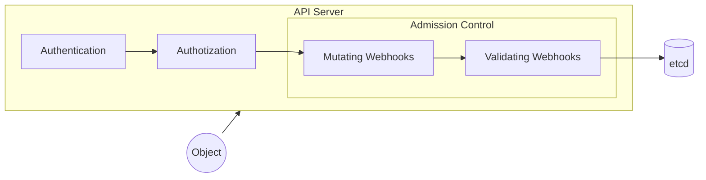

## 背景

Volcano[^volcano] 是在 Kubernetes 上运行高性能工作负载的容器批量计算引擎，其定义了 `Job` CRD 用于描述 Volcano 中作业的执行。

```yaml
apiVersion: batch.volcano.sh/v1alpha1
kind: Job
metadata:
  name: test-job
spec:
  minAvailable: 3
  schedulerName: volcano
  priorityClassName: high-priority
  queue: default
  tasks:
    - replicas: 6
      name: "default-nginx"
      template:
        metadata:
          name: web
        spec:
          containers:
            - image: nginx
              imagePullPolicy: IfNotPresent
              name: nginx
              resources:
                requests:
                  cpu: "1"
          restartPolicy: OnFailure
```

(Source: [VolcanoJob | Volcano](https://volcano.sh/en/docs/vcjob/#example))

```diff
apiVersion: batch.volcano.sh/v1alpha1
kind: Job
metadata:
  name: test-job
spec:
  minAvailable: 3
  schedulerName: volcano
  priorityClassName: high-priority
  queue: default
+ extraJobField: extraJobField
  tasks:
    - replicas: 6
      name: "default-nginx"
      template:
        metadata:
          name: web
        spec:
          containers:
            - image: nginx
              imagePullPolicy: IfNotPresent
              name: nginx
              resources:
                requests:
                  cpu: "1"
          restartPolicy: OnFailure
+         extraTaskField: extraTaskField
```

为了满足内部业务的需要，我们对 Volcano 的 Job CRD 进行了特定的修改，**先后在两次更新中**于 `.spec.extraJobField` 与 `.spec.tasks[0].extraTaskField` 添加了额外的字段。

## 症状

在通过 `client-go` 创建 Volcano Job 时，发现创建出的 Job 虽然有 `.spec.extraJobField` 字段，但是缺失了 `.spec.tasks[0].extraTaskField` 字段。

## 原因

首先，我们检查了集群内部署的 CRD 的版本，发现是已经添加过 `.spec.tasks[0].extraTaskField` 字段的最新版本。此外，为了排除是否是 `controller-runtime` 或是 `client-go` 本身相关的问题，我们尝试使用 `kubectl` 的方式基于 YAML 文件创建 Volcano Job，但是没有触发前述问题，因此我们初步判断问题可能出现在请求经过 API Server 的准入阶段的时候。



上图描述了请求 Kubernetes API 的时候会经历的几个步骤：

1. 身份验证（Authentication）[^authentication]
2. 授权（Authorization）[^authorization]
3. 准入控制（Admission Control）[^admission-controllers]
   1. 验证（Validating）
   2. 变更（Mutating）

Volcano 针对其定义的 CRD（Job、PodGroup 与 Queue）以及 Pod 都有定义 Validating 和 Mutating Webhook。在 Mutating Webhook 的过程中，该 Webhook 在一定条件下会对请求的资源对象进行修改。

[`pkg/webhooks/admission/jobs/mutate/mutate_job.go#L83-L112`](https://github.com/volcano-sh/volcano/blob/release-1.10/pkg/webhooks/admission/jobs/mutate/mutate_job.go#L83-L112)

```go
// Jobs mutate jobs.
func Jobs(ar admissionv1.AdmissionReview) *admissionv1.AdmissionResponse {
	...
	job, err := schema.DecodeJob(ar.Request.Object, ar.Request.Resource)
	if err != nil {
		return util.ToAdmissionResponse(err)
	}

	var patchBytes []byte
	switch ar.Request.Operation {
	case admissionv1.Create:
		patchBytes, _ = createPatch(job)
	default:
		err = fmt.Errorf("expect operation to be 'CREATE' ")
		return util.ToAdmissionResponse(err)
	}
	...
}
```

通过断点与日志等调试方法，我们发现在调用 `schema.DecodeJob` 的时候，解码出来的 `job` 对象就已经缺失了 `.spec.tasks[0].extraTaskField` 字段，由此可以推断此处 Task 相关的 CRD 的定义并不是最新的版本。

[`pkg/webhooks/admission/jobs/mutate/mutate_job.go#L114-L142`](https://github.com/volcano-sh/volcano/blob/release-1.10/pkg/webhooks/admission/jobs/mutate/mutate_job.go#L114-L142)

```go
func createPatch(job *v1alpha1.Job) ([]byte, error) {
	...
	pathSpec := mutateSpec(job.Spec.Tasks, "/spec/tasks", job)
	if pathSpec != nil {
		patch = append(patch, *pathSpec)
	}
	...
}
```

只有当调用 `mutateSpec` 函数后返回的 `pathSpec` 不为 `nil` 的时候才会将其添加到 `patch` 中。

[`pkg/webhooks/admission/jobs/mutate/mutate_job.go#L185-L223`](https://github.com/volcano-sh/volcano/blob/release-1.10/pkg/webhooks/admission/jobs/mutate/mutate_job.go#L185-L223)

```go
func mutateSpec(tasks []v1alpha1.TaskSpec, basePath string, job *v1alpha1.Job) *patchOperation {
	// TODO: Enable this configuration when dependOn supports coexistence with the gang plugin
	// if _, ok := job.Spec.Plugins[mpi.MpiPluginName]; ok {
	// 	mpi.AddDependsOn(job)
	// }
	patched := false
	for index := range tasks {
		// add default task name
		taskName := tasks[index].Name
		if len(taskName) == 0 {
			patched = true
			tasks[index].Name = v1alpha1.DefaultTaskSpec + strconv.Itoa(index)
		}

		if tasks[index].Template.Spec.HostNetwork && tasks[index].Template.Spec.DNSPolicy == "" {
			patched = true
			tasks[index].Template.Spec.DNSPolicy = v1.DNSClusterFirstWithHostNet
		}

		if tasks[index].MinAvailable == nil {
			patched = true
			minAvailable := tasks[index].Replicas
			tasks[index].MinAvailable = &minAvailable
		}

		if tasks[index].MaxRetry == 0 {
			patched = true
			tasks[index].MaxRetry = defaultMaxRetry
		}
	}
	if !patched {
		return nil
	}
	return &patchOperation{
		Op:    "replace",
		Path:  basePath,
		Value: tasks,
	}
}
```

在 `mutateSpec` 函数中，对于每一个 Task 都会进行一系列的检查，如果有字段缺失会对其进行默认值的填充，具体而言：

1. `tasks[].Name` 为空时，填充 `v1alpha1.DefaultTaskSpec`（即 `default`） + `strconv.Itoa(index)` 为默认值；
2. `tasks[].Template.Spec.HostNetwork` 不为 `nil` 且 `tasks[].Template.Spec.DNSPolicy` 为空时，填充 `v1.DNSClusterFirstWithHostNet` 为 `DNSPolicy` 的默认值；
3. `tasks[].MinAvailable` 为 `nil` 时，填充 `tasks[].Replicas` 为默认值；
4. `tasks[].MaxRetry` 为 `0` 时，填充 `defaultMaxRetry`（即 `3`） 为默认值。

在以上任一分支触发后，即会返回 patch 操作的结果，此处是通过 `replace` 操作对 `.spec.tasks` 字段整体进行替换的。

### 小结

综上，实际上产生问题的原因主要是由于在更新 CRD 之后没有重新构建并部署 Webhook，导致 Mutating Webhook 在解码 Task 的时候缺失了字段，被解码的对象**仅在**填充默认值的时候才会被使用并加入到 Patch 中。

后续在验证过程中，我们发现问题并不能被稳定复现，其主要原因在于使用 `kubectl` 创建 Volcano Job 时所创建的 YAML 文件的 Sepcification 是直接通过 `kubectl get vcjob -oyaml` 得到的，因此所有的默认值已经被填充了，在经过 Mutating Webhook 的时候相关的字段不会被覆盖。

此外，由于集群中的 CRD 已经被更新了，即 `.spec.extraJobField` 与 `.spec.tasks[0].extraTaskField` 两个字段都存在，所以在 API Server 验证的时候皆不会产生问题。

## 解决方案

基于修改过的 CRD API 定义重新构建镜像并部署 Webhook 服务即可。

[^volcano]: [Volcano](https://volcano.sh/)

[^authentication]: [Authenticating | Kubernetes](https://kubernetes.io/docs/reference/access-authn-authz/authentication/)

[^authorization]: [Authenticating | Kubernetes](https://kubernetes.io/docs/reference/access-authn-authz/authorization/)

[^admission-controllers]: [Admission Controllers | Kubernetes](https://kubernetes.io/docs/reference/access-authn-authz/admission-controllers/)
