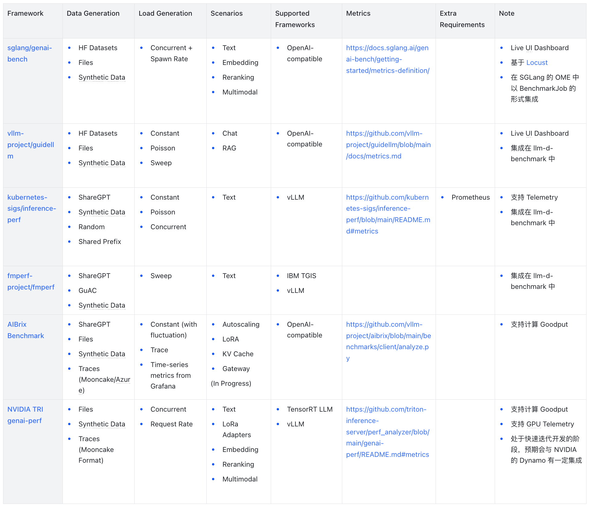

## 概览

随着大语言模型（LLM）的广泛应用，LLM 的推理服务已成为现代人工智能基础设施的核心组件。在生产环境中，LLM 推理服务所面对的工作负载呈现出高度的异构性特征，不同的应用场景对延迟、吞吐量等指标反映的服务质量的要求差异巨大，如实时聊天要求较低的 TTFT 与 TPOT，RAG 的场景会相对更宽松，而批量推理则会更关注整体的端到端吞吐量。

目前，推理引擎层面的工具如 vLLM 和 SGLang 各自开发了专门的基准测试工具来评估核心推理性能和优化效果。同时，同时，编排层的解决方案如 AIBrix、llm-d 等也提供了端到端的基准测试方案，用于验证复杂生产环境下的整体系统性能是否满足预期的服务等级目标（SLO）。值得注意的是，Kubernetes 的 Serving Workgroup 也提出了 kubernetes-sigs/inference-perf 项目，旨在为 LLM 推理服务建立标准化的性能评估框架。

本文将分析 LLM 推理基准测试的理论基础与工程实践，深入理解核心原理以及当前开源社区中主要的 LLM 推理基准测试解决方案，为生产环境中的 LLM 推理服务性能评估提供实用指南。

## 背景

### Benchmark v.s. Inference Benchmark

为了准确理解本文的讨论范围，我们需要明确区分两类不同的 LLM 基准测试：

- LLM 基准测试（LLM Benchmark）：该类测试专注于评估 LLM 模型本身的能力表现，通过标准化的任务集合（如 GLUE、MMLU、SWE-bench 等）来衡量模型在语言理解、推理、代码生成、数学计算等维度的准确性和可靠性。该过程也被称作模型评估（Evaluation），主要关注模型输出的质量而非推理过程的效率，LLM 基准测试的内容不在本文所涉及的范畴中。
- LLM 推理基准测试（LLM Inference Benchmark）：这类测试专注于评估 LLM 推理服务在实际部署环境中的性能表现，包括延迟、吞吐量、资源利用率、稳定性等工程指标，其关注的是如何高效地运行模型。

### Goals and Non-Goals

#### Goals

- 了解推理服务或硬件平台的性能边界和瓶颈特征
- 量化评估推理服务优化措施的实际效果
- 为生产环境的容量规划和资源配置提供数据支撑

#### Non-Goals

- 评估特定场景下模型回答的准确性或质量（应使用 LLM 基准测试）
- 提供生产环境中的实时性能监控（应通过 Prometheus、Grafana 等可观测性基础设施实现）

## 指标

LLM 推理基准测试涉及多个维度的性能指标，这些指标构成了评估推理服务性能的核心。

| 分类 | 指标 | 描述 | 计算方法 |
|------|------|------|----------|
| 延迟 | TTFT | 生成第一个输出Token的时间。 | 获得第一个Token的时间 - 启动时间 |
| 延迟 | TPOT | 生成两个连续的Token的平均时间 | (端到端延迟 - TTFT) / (输出Token - 1) |
| 延迟 | 端到端延迟 | 端到端的延迟，表示从提交请求到获取完整回答的时间。 | 结束时间 - 开始时间 |
| 延迟 | 输出延迟 | 输出的延迟，表示从提交请求到获取第一个Token的时间。 | 端到端延迟 - TTFT |
| 吞吐量 | 输入吞吐量 | 输入过程的吞吐量。 | 输入Token / TTFT |
| 吞吐量 | 输出吞吐量 | 输出过程的吞吐量。 | (输出Token - 1) / 输出延迟 |
| 请求 | 错误率 | 请求发生错误的概率。 | 错误请求数量 / 请求数量 |
| 请求 | 单位时间请求数 | 单位时间内处理请求的数量。 |  |

## 推理基准测试框架


LLM 推理服务的基准测试框架一般由以下几个部分构成：

- Data Generator：基准测试中使用的数据集；
- Load Generator：基准测试中的工作负载；
- Client：用于向推理服务发送请求并收集指标的客户端；
- Report Generator：根据收集的指标导出或生成报告。

数据首先由 Data Generator 生成或加载，然后 Load Generator 根据预设的负载模式控制请求的发送时序，Client 负责实际的请求发送和响应处理，最后 Report Generator 汇总分析收集到的性能数据。

### Data Generator

数据生成器负责为基准测试提供输入数据集，其质量直接影响测试结果的代表性和实用价值。不同的数据来源适用于不同的测试目标和应用场景。

- Public Datasets：使用公开的数据集，适用于通用的性能评估，但可能与生产场景的工作负载存在差异。
  - ShareGPT：包含大量真实的用户与ChatGPT的对话记录。
- Synthetic Data：人工生成的合成数据，根据文件与指定的分布生成特定输入与输出长度的数据集。
  - Constant：生成输入输出长度完全一致的请求，主要用于测试系统在特定配置下的稳定性能。
  - Normal Distribution：根据指定的均值和标准差生成符合正态分布的长度序列。
  - Uniform Distribution：在指定的最小值和最大值之间均匀生成长度序列。
- Logs
  - 基于推理服务的真实数据作为数据源，便于重放生产环境中特定时间段的数据分布。
- Traces
  - [Mooncake](https://github.com/kvcache-ai/Mooncake/tree/main/FAST25-release/traces). [Mooncake: Trading More Storage for Less Computation — A KVCache-centric Architecture for Serving LLM Chatbot](https://www.usenix.org/conference/fast25/presentation/qin), FAST 2025
  ```jsonl
  {"timestamp": 0, "input_length": 6758, "output_length": 500, "hash_ids": [0, 1, 2, 3, 4, 5, 6, 7, 8, 9, 10, 11, 12, 13]}
  {"timestamp": 0, "input_length": 7322, "output_length": 490, "hash_ids": [0, 14, 15, 16, 17, 18, 19, 20, 21, 22, 23, 24, 25, 26, 27]}
  ```
  - [AzurePublicDataset](https://github.com/Azure/AzurePublicDataset/blob/master/data/AzureLLMInferenceTrace_conv.csv). [DynamoLLM: Designing LLM Inference Clusters for Performance and Energy Efficiency](https://arxiv.org/abs/2408.00741), HPCA 2025
  ```csv
  TIMESTAMP,ContextTokens,GeneratedTokens
  2023-11-16 18:15:46.6805900,374,44
  2023-11-16 18:15:50.9951690,396,109
  2023-11-16 18:15:51.2224670,879,55
  2023-11-16 18:15:51.3910170,91,16
  2023-11-16 18:15:52.5732450,91,16
  2023-11-16 18:15:52.9921190,381,84
  2023-11-16 18:15:54.4260870,1313,142
  2023-11-16 18:15:54.9320210,388,84
  2023-11-16 18:15:55.0176690,242,14
  ```
  - [Aliyun Bailian](https://github.com/alibaba-edu/qwen-bailian-usagetraces-anon). [KVCache Cache in the Wild: Characterizing and Optimizing KVCache Cache at a Large Cloud Provider](https://arxiv.org/abs/2506.02634), USENIX ATC 2025
  ```json
  {
    "chat_id": 159,                                   // Randomized chat identifier
    "parent_chat_id": 55,                             // -1 for root requests
    "timestamp": 61.114,                              // Seconds since request arrive
    "input_length": 521,                              // Input token count
    "output_length": 132,                             // Output token count
    "type": "text",                                   // Request type: text/search/image/file
    "turn": 2,                                        // Conversation turn number
    "hash_ids": [1089, 1090, 1091, 6326, ..., 13148]  // Salted SipHash blocks (16 tokens per block)
  }
  ```

### Load Generator

负载生成器是基准测试框架中负责控制请求发送时序的组件，需要模拟各种负载特征，其会影响基准测试结果的准确性与实用性。

- Distribution
  - Constant：按固定时间间隔发送请求，测试结果稳定但无法反应工作负载的异构性与突发性。
  - Poisson：根据泊松分布发送请求，更接近真实用户行为的随机请求到达模式，能够更好地模拟异构的工作负载。
  - Sweep：在指定的请求速率区间内按照预设步长逐步提升负载强度，便于寻找系统的性能边界。
- Traces
  - 与 Dataset 相同，如果 Trace 中提供请求的时间戳的话，也可根据时间戳形成工作负载。

除了前述的几种分布以外，一些基准测试框架还引入了波动机制（Fluctuation），在基础的工作负载上叠加波动，能够更加真实地反映生产环境中的不确定性。

### Client

基准测试框架需要基于客户端发送请求，并根据返回的数据计算和收集特定的指标。由于主流的 LLM 推理框架如 vLLM 与 SGLang 等都实现了兼容 OpenAI API 的接口，大部分的 LLM 推理基准测试框架普遍都采用兼容 OpenAI API 的客户端实现，简化了基准测试框架的开发与维护成本。

#### OpenAI

```json
// https://platform.openai.com/docs/api-reference/chat/create
{
  "id": "chatcmpl-B9MBs8CjcvOU2jLn4n570S5qMJKcT",
  "object": "chat.completion",
  "created": 1741569952,
  "model": "gpt-4.1-2025-04-14",
  "choices": [
    {
      "index": 0,
      "message": {
        "role": "assistant",
        "content": "Hello! How can I assist you today?",
        "refusal": null,
        "annotations": []
      },
      "logprobs": null,
      "finish_reason": "stop"
    }
  ],
  "usage": {
    "prompt_tokens": 19,
    "completion_tokens": 10,
    "total_tokens": 29,
    "prompt_tokens_details": {
      "cached_tokens": 0,
      "audio_tokens": 0
    },
    "completion_tokens_details": {
      "reasoning_tokens": 0,
      "audio_tokens": 0,
      "accepted_prediction_tokens": 0,
      "rejected_prediction_tokens": 0
    }
  },
  "service_tier": "default"
}
```

针对兼容 OpenAI API 的推理服务，在其接口定义中提供了 usage 来获得详细的 Token 使用统计信息，便于计算准确的关键指标。当推理服务没有返回 usage的时候，可以在基准测试的客户端使用模型对应的 Tokenizer 根据文本内容近似计算 Token 的数量，确保计算结果的一致性。

```jsonl
// https://platform.openai.com/docs/api-reference/chat_streaming/streaming
{"id":"chatcmpl-123","object":"chat.completion.chunk","created":1694268190,"model":"gpt-4o-mini", "system_fingerprint": "fp_44709d6fcb", "choices":[{"index":0,"delta":{"role":"assistant","content":""},"logprobs":null,"finish_reason":null}]}
{"id":"chatcmpl-123","object":"chat.completion.chunk","created":1694268190,"model":"gpt-4o-mini", "system_fingerprint": "fp_44709d6fcb", "choices":[{"index":0,"delta":{"content":"Hello"},"logprobs":null,"finish_reason":null}]}
....
{"id":"chatcmpl-123","object":"chat.completion.chunk","created":1694268190,"model":"gpt-4o-mini", "system_fingerprint": "fp_44709d6fcb", "choices":[{"index":0,"delta":{},"logprobs":null,"finish_reason":"stop"}]}
```

在使用流式的 API 的时候，推理服务会逐段发送生成的文本片段，并使用最终的分片标记生成的结束，并提供 Token 使用统计信息（根据推理服务的实现可能需要单独处理）。

### Report Generator

报告生成器汇总分析收集到的性能数据，生成可视化的报告，帮助用户理解系统的性能特征和潜在问题。

## 对比

### 框架

- [sglang/genai-bench](https://github.com/sglang/genai-bench)：genai-bench 是 SGLang 社区开源的用于用于 LLM 推理服务的全面 Token 级别性能评估基准测试工具，它提供了详细的模型服务性能洞察、具备用户友好的 CLI 工具和实时的 UI 界面用于进度监控。
- [vllm-project/guidellm](https://github.com/vllm-project/guidellm)：guidellm 是由 Neural Magic（被 Red Hat 收购）开源的基准测试工具，后加入 vLLM 社区，其能够通过模拟真实的推理工作负载，评估在不同硬件配置上部署 LLM 的性能与资源需求。
- [kubernetes-sigs/inference-perf](https://github.com/kubernetes-sigs/inference-perf)：inference-perf 是一个源于 Kubernetes Serving Workgroup 的专门用于 GenAI 推理性能基准测试的工具，该工具具有高度的可扩展性，能够支持大规模生产环境推理部署的基准测试。
- [fmperf-project/fmperf](https://github.com/fmperf-project/fmperf)：fmperf 是一个 IBM 开源的基于 Python 的云原生基准测试工具，专门用于评估 LLM 推理服务框架的性能和能耗。
- [AIBrix Benchmark](https://github.com/vllm-project/aibrix/tree/main/benchmarks)：AIBrix 项目提供的基准测试框架，专门用于评估 AIBrix 云原生 LLM 推理基础设施的性能，也可用于单独的 LLM 推理服务。
- [NVIDIA TRI genai-perf](https://github.com/triton-inference-server/perf_analyzer/tree/main/genai-perf)：genai-perf 是 NVIDIA Triton Inference Server 的 GenAI 性能分析器，专门用于测量 LLM 推理服务的吞吐量与延迟等核心指标。

### 对比概览

- Data Generation：支持的数据生成的方式；
- Load Generation：支持的负载生成的方式；
- Scenarios：支持的场景，如文本、RAG 等；
- Supported Frameworks：支持的推理框架；
- Metrics：支持的指标。



### 小结

现有的 LLM 推理基准测试解决方案在核心指标采集方面已形成相对成熟的标准，TTFT、TPOT 等关键指标的定义和计算方法基本达成共识。sglang/genai-bench 与 vllm-project/guidellm 等主流工具对兼容 OpenAI API 的推理服务提供了良好支持，简化了基准测试的部署和维护成本。

场景支持方面，文本生成是所有框架的基础功能，Embedding、Reranking 与多模态等场景的支持程度不一。数据生成支持方面，大多数框架都支持 HuggingFace 数据集、文件输入和合成数据生成，但在附加功能如基于 Trace 的重放方面存在差异。负载生成模式上，恒定与泊松分布是主流支持的模式，部分框架还支持带波动的负载和基于 Trace 的重放。

除了前述内容以外，以下两点笔者认为相当值得关注：

- **Harness**：llm-d 的 llm-d-benchmark 集成了 inference-perf、fmperf 与 guidellm 作为实际运行基准测试的工具，并且可以统合前述工具的实验报告生成统一的报告。
- **Goodput**：Goodput 指的是实际有效的工作负载，在基准测试的场景中可以指满足特定 SLO 的请求的吞吐量。AIBrix Benchmark 与 NVIDIA genai-perf 都支持在生成报告的时候根据指定的 SLO 生成 Goodput。此外，vllm-project/guidellm#197 中提到了在对新的模型或硬件基准测试的时候，用户的目标可能是探究在满足特定 SLO 的前提下的最大并发数，因此提出了类似 Sweep 的方式基于二分搜索对可能的参数空间进行搜索。

## 结语

随着大语言模型在各类应用中的持续落地，LLM 推理基准测试已成为保障服务性能和稳定性的关键环节。本文系统梳理了推理基准测试的理论基础、核心指标、主流工具及其对比，旨在帮助读者理解如何使用 LLM 推理基准测试评估 LLM 推理服务。随着模型规模和应用场景的不断扩展，推理基准测试工具和方法也将持续演进。建议开发者结合实际业务需求，灵活选用合适的基准测试方案，为 LLMOps 基础设施的性能优化提供更精确的数据支撑，并与生产环境监控体系协同，持续提升 LLM 推理服务的性能和可靠性。

### 相关文章

- [Key metrics for LLM inference | LLM Inference Handbook](https://bentoml.com/llm/inference-optimization/llm-inference-metrics)
- [LLM performance benchmarks | LLM Inference Handbook](https://bentoml.com/llm/inference-optimization/llm-performance-benchmarks)
- [LLM Inference Benchmarking: Fundamental Concepts | NVIDIA Technical Blog](https://developer.nvidia.com/blog/llm-benchmarking-fundamental-concepts/)
- [LLM Inference Benchmarking Guide: NVIDIA GenAI-Perf and NIM | NVIDIA Technical Blog](https://developer.nvidia.com/blog/llm-performance-benchmarking-measuring-nvidia-nim-performance-with-genai-perf/)
- [LLM Inference Benchmarking: How Much Does Your LLM Inference Cost? | NVIDIA Technical Blog](https://developer.nvidia.com/blog/llm-inference-benchmarking-how-much-does-your-llm-inference-cost/)
- [LLM Inference Benchmarking: Performance Tuning with TensorRT-LLM | NVIDIA Technical Blog](https://developer.nvidia.com/blog/llm-inference-benchmarking-performance-tuning-with-tensorrt-llm/)
- [Overview — NVIDIA NIM LLMs Benchmarking](https://docs.nvidia.com/nim/benchmarking/llm/latest/overview.html)
- [Benchmarking LLM Inference Backends](https://www.bentoml.com/blog/benchmarking-llm-inference-backends)
- [Reproducible Performance Metrics for LLM inference](https://www.anyscale.com/blog/reproducible-performance-metrics-for-llm-inference)
- [LLM Inference Performance Engineering: Best Practices | Databricks](https://www.databricks.com/blog/llm-inference-performance-engineering-best-practices)

### 相关项目

- [sglang/genai-bench](https://github.com/sglang/genai-bench)
- [vllm-project/guidellm](https://github.com/vllm-project/guidellm)
- [llm-d/llm-d-benchmark](https://github.com/llm-d/llm-d-benchmark)
- [kubernetes-sigs/inference-perf](https://github.com/kubernetes-sigs/inference-perf)
- [AIBrix Benchmark](https://github.com/vllm-project/aibrix/tree/main/benchmarks)
- [NVIDIA TRI genai-perf](https://github.com/triton-inference-server/perf_analyzer/tree/main/genai-perf)
- [huggingface/inference-benchmarker](https://github.com/huggingface/inference-benchmarker)
- [ray-project/llmperf](https://github.com/ray-project/llmperf)
- [fw-ai/benchmark](https://github.com/fw-ai/benchmark)
- [ninehills/llm-inference-benchmark](https://github.com/ninehills/llm-inference-benchmark)
