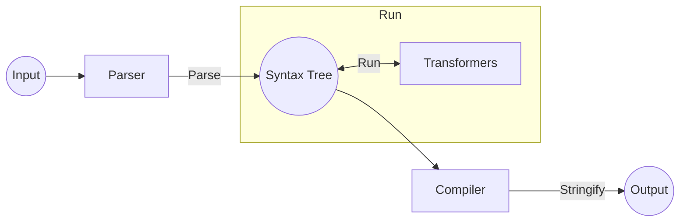
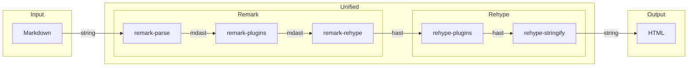

## 引言

我于 2019 年开始使用 [Hugo](https://gohugo.io/) 来构建我的博客，在那个时间点的话静态博客的方案选项还挺多的，除了 Hugo 之外还有 [Jekyll](https://jekyllrb.com/)、[Hexo](https://hexo.io/) 与 [Gatsby](https://www.gatsbyjs.com/) 等，印象中早期 GitHub Pages 针对 Jekyll 提供了第一方的集成支持，因此那时候 Jekyll 是许多人搭建静态博客的首选。Hugo 是个使用 Go 语言的静态网站生成器，当时应该是刚好开始接触 [Kubernetes](https://kubernetes.io/) 和 [Go](https://go.dev/)，而 Kubernetes 本身官方文档采用的就是 Hugo 的 [Docsy](https://www.docsy.dev/) 主题，可能也算是爱屋及乌吧，所以就选择了 Hugo。

起初我是采用了 [vividvilla/ezhil](https://github.com/vividvilla/ezhil) 作为博客的主题，我很喜欢里面的一些设计风格，不会过于花里胡哨。但是过了一段时间之后就发现有些方面又不大符合我的需求，包括一些 Markdown 解析上的扩展，单纯 Fork 出去的话也不太好和上游对齐，最后在 2020 年的时候还是决定自己编写 Hugo 的主题 [rudeigerc/yggdrasill](https://github.com/rudeigerc/yggdrasill)。仓库中有提到，编写主题的时候走马观花地借鉴了不少人的设计，同时满足了一些基本的定制化的需求后，形成了一个比较稳定的版本，就一直沿用了四年到了现在。

Hugo 编写主题的时候主要采用的是 Go Template 的方式，说实在的并不是特别好用，尤其是在 HTML 里使用的时候（以及在 [Helm](https://helm.sh/) 里已经被深深折磨之后），先前尝试了几个 ESlint 和 Prettier 的插件都没办法很好地去格式化代码，代码补全也有点问题，变量嵌套太深的时候并不是特别好处理，到最后代码的可维护性并不是特别好。

此时，我在偶然之中了解到了 [Astro](https://astro.build/)，我认为 Astro 的吸引我的部分主要是其高度的可扩展性，可以根据自己的需求进行相当细粒度的定制，不会受限于框架本身的约束，包括：

1. 基于 [Astro Integration API](https://docs.astro.build/en/reference/integrations-reference/) 的 Astro 扩展集成;
2. 基于 [Remark](https://github.com/remarkjs/remark) 与 [Rehype](https://github.com/rehypejs/rehype) 插件的 Markdown 渲染扩展；
3. 基于 [Shiki Transformers](https://shiki.matsu.io/guide/transformers) 的语法高亮扩展。

在接下来的部分当中，我想简单介绍一下这次将博客从 Hugo 迁移到 Astro 的过程中的一些想法与选型。

## 将文章从 Hugo 迁移到 Astro

Astro 提出了 [Collection](https://docs.astro.build/en/guides/content-collections/) 的概念对内容进行管理，并使用 [colinhacks/zod](https://github.com/colinhacks/zod) 进行基于 TypeScript 的 Frontmatter 的类型校验。

如果 Astro 项目基于的是自带的 Blog 模板的话，除了需要将 Hugo 中用于标识日期的元数据 `date` 替换为 `pubDate` 以外（当然直接修改 Astro 中 `content` 的元数据也是可行的），大部分的元数据与 Hugo 是通用的，因此文章内容上基本没什么迁移成本。

```ts title="src/content/config.ts"
const blog = defineCollection({
  type: "content",
  schema: z.object({
    title: z.string(),
    description: z.string().default(""),
    pubDate: z.coerce.date(),
    updatedDate: z.coerce.date().optional(),
    heroImage: z.string().optional(),
    draft: z.boolean().optional().default(false),
    categories: z.array(z.string()).optional(),
    tags: z.array(z.string()).optional(),
    series: z.array(z.string()).optional(),
  }),
});
```

这是我在本项目中实际定义博客的 Schema，Astro 会根据在此处定义的类型相关的约束自动对 `content` 中对应 `collection`（即 `blog`）中文件的 Frontmatter 进行校验。

## 使用 Biome 作为 Linter 与 Formatter

一般而言，一个前端项目需要配置包括 `eslint`（Linting）、`stylelint`（Linting）与 `prettier`（Formatting）在内的多种 Linter 与 Formatter。[Biome](https://biomejs.dev/) 是一个适用于 JavaScript、JSON 与 CSS 等 Web 开发相关编程语言的工具，包括 Linter 与 Formatter，与前述工具的配置规则有着相当高的兼容性，因此可以以较低成本从这些工具迁移到 Biome 上。

比较可惜的是目前 Biome 对 Astro 的支持目前还不是特别完善[^biome-language-support]，针对 Astro 文件仅有 Frontmatter 部分的支持，从实用性上来说就略显鸡肋。Astro 自身以及 Astro 的一些相关网站 [astro.build](https://github.com/withastro/astro.build) 与 [withastro/astro.new](https://github.com/withastro/astro.new) 先前也引入了 Biome 作为其 Linter 与 Formatter，但是之后又将 Prettier 重新引入作为 Astro 文件的默认 Formatter，我现在所采用的配置主要就来自于 [withastro/astro.build](https://github.com/withastro/astro.build) 仓库中的相关配置。

Biome 会从 `biome.json` 文件中读取配置，此处将 `formatter` 配置为对 `*.astro` 不启用：

```json title="biome.json" {6}
{
  "$schema": "./node_modules/@biomejs/biome/configuration_schema.json",
  ...
  "formatter": {
    "enabled": true,
    "ignore": ["*.astro", "pnpm-lock.yaml"]
  },
  ...
}
```

同时根据 Astro 官方的配置指引[^astro-prettier]配置 Prettier：

```js title="prettier.config.mjs"
/** @type {import("prettier").Config} */
export default {
  plugins: ["prettier-plugin-astro"],
  overrides: [
    {
      files: "*.astro",
      options: {
        parser: "astro",
      },
    },
  ],
};
```

如果使用的是 VSCode 的话，需要注意为不同的文件类型启用相对应的插件。

## Tailwind CSS + Shadcn UI

我本身前端相关的经验主要都是基于 React 或是 Vue 配合现成的组件库（如 [Material UI](https://mui.com/material-ui/) 与 [Ant Design](https://ant.design/)）配合一些 CSS-in-JS 的框架对样式进行自定义，此次刚好有机会能够使用 Tailwind CSS 来体验一下使用原子化 CSS[^atmoic-css]编写样式的感觉，Astro 同时也以 [Integration](https://docs.astro.build/en/reference/integrations-reference/) 的形式提供了对 Tailwind CSS 的支持。

在引入了 Tailwind CSS 的基础上，我采用 [shadcn/ui](https://ui.shadcn.com/) 作为基底的组件库，不得不说使用 shadcn 的体验相当理想，尤其是对我这种轻前端的人来说，不用过多关注设计的细节就可以实现相当不错的效果，在自定义样式的时候也很方便，只需直接引入原子化 CSS 对应的类即可。此外，[shadcn-ui/taxonomy](https://github.com/shadcn-ui/taxonomy) 也提供了一些页面的设计可作为参考。

有关如何在 Astro 项目中引入 Tailwind CSS 与 `shadcn`，可以参考 `shadcn/ui` 的相关文档[^shadcn-astro]。

## 基于 Giscus 的评论系统

在博客搭建的初期我采用的是 [Disqus](https://disqus.com/) 作为评论系统，这也是 Hugo 提供第一方支持的评论系统，但是评论数据托管在没什么关联性的第三方网站上总归还是感觉有点奇怪，而且还有隐私与数据安全性的问题，我印象中当时 Disqus 也因此引发过相当大的争论，因此之后我就在寻找评论系统的替代品，最终选择了 Giscus。

[Giscus](https://giscus.app/) 是一个基于 [GitHub Discussions](https://docs.github.com/en/discussions) 的评论系统，只需要进行简单的 JavaScript 配置就可以将其引入到博客当中。

```js
<script src="https://giscus.app/client.js"
        data-repo="[ENTER REPO HERE]"
        data-repo-id="[ENTER REPO ID HERE]"
        data-category="[ENTER CATEGORY NAME HERE]"
        data-category-id="[ENTER CATEGORY ID HERE]"
        data-mapping="pathname"
        data-strict="0"
        data-reactions-enabled="1"
        data-emit-metadata="0"
        data-input-position="bottom"
        data-theme="preferred_color_scheme"
        data-lang="en"
        crossorigin="anonymous"
        async>
</script>
```

## 基于 Pagefind 的搜索集成

[Pagefind](https://pagefind.app/) 是一个使用 Rust 编写的静态搜索库，具有高效的搜索性能，可以很方便地与静态网站框架集成，仅需要在构建后的静态文件的基础上构建索引即可。

如果要在 Astro 中引入 Pagefind 的支持，Astro 默认会将构建后的文件输出到 `dist` 目录，因此只需要在 `pagefind.yaml` 文件中指定 `site` 为 `dist` 即可：

```yaml title="pagefind.yaml"
site: dist
```

同时在 `package.json` 中添加 Post Hook 以在构建完成后运行 Pagefind：

```json title="package.json" {4}
"scripts": {
  "preinstall": "npx only-allow pnpm",
  "build": "astro check && astro build",
  "postbuild": "pnpx pagefind"
}
```

## 基于 Remark 与 Rehype 的 Markdown 扩展

Astro 基于 Remark 提供了 Markdown 渲染的支持，其默认启用了一些 Remark 插件，如 `remark-gfm` 与 `remark-smartypants`，同时也支持用户自定义的 Remark 插件与 Rehype 插件。



[`unified`](https://github.com/unifiedjs/unified) 是基于抽象语法树的文本内容统一接口，前文提到的 Remark 与 Rehype 插件都是其生态系统的一部份。使用 unified 的处理过程主要包含三个步骤：

1. Parser（parse）：将输入的文本转换成抽象语法树；
2. Transformer（run）：对抽象语法树进行处理；
3. Compiler（stringify）：将抽象语法树重新编译成文本。



上图展示的是一个具体的例子，其简要描述了 Astro 使用 Remark 与 Rehype 插件渲染 Markdown 文件的部分过程（此处省略了一些 Astro 默认启用的插件以及一些 Astro 内部的自定义插件），具体包括：

1. 通过 `remark-parse` 将输入的 Markdown 文本转换成 Markdown 抽象语法树 `mdast`；
2. 运行配置中的自定义 `remark` 插件；
3. 通过 `remark-rehype` 插件将 `mdast` 转换成超文本抽象语法树 `hast`；
4. 运行配置中的自定义 `rehype` 插件；
5. 通过 `rehype-stringify` 将 `hast` 重新编译成文本输出。

此外，Astro 默认使用的语法高亮工具 [Shiki](https://shiki.style/) 也提供了 [Transformers](https://shiki.style/guide/transformers) 的方式基于 `hast` 对代码高亮的支持提供了多个扩展点。

通过前述的几种方式（`remark` 插件、`rehype` 插件与 Shiki Transformers）都可以很方便地基于抽象语法树对 Markdown 渲染过程中的特定步骤进行自定义扩展。

## 结语

本文介绍了一些我在将博客从 Hugo 迁移到 Astro 的时候的一些想法与选型。我认为能够从头开始搭建博客是一件相当有意思的事情，虽然我本身并不是专职的前端工程师，但也能靠着现有成熟框架的封装来自行搭建一个算是相当符合自身审美以及需求的内容展示平台。对于对前端并不是特别熟悉的工程师来说，在如今有了 [Cursur](https://www.cursor.com/) 以及 [v0](https://v0.dev/) 等工具辅助之后，想必像这样自行 DIY 的成本与难度会更低，如果对此感兴趣的话也可以尝试一下。

后续如果有机会的话，希望基于前文所提到的部分选型来进行详细的介绍，包括一些具体的实现细节与配置方法，以及其它的实现方案与对比。

## References

- [Migrating from Hugo | Docs](https://docs.astro.build/en/guides/migrate-to-astro/from-hugo/)
- [如何优雅编译一个 Markdown 文档 - DIYgod](https://diygod.cc/unified-markdown)

[^biome-language-support]: [Language support | Biome](https://biomejs.dev/internals/language-support/#html-super-languages-support)
[^shadcn-astro]: [Astro - shadcn/ui](https://ui.shadcn.com/docs/installation/astro)
[^atmoic-css]: [Let’s Define Exactly What Atomic CSS Is | CSS-Tricks](https://css-tricks.com/lets-define-exactly-atomic-css/)
[^astro-prettier]: [Editor Setup | Docs](https://docs.astro.build/en/editor-setup/#prettier)
