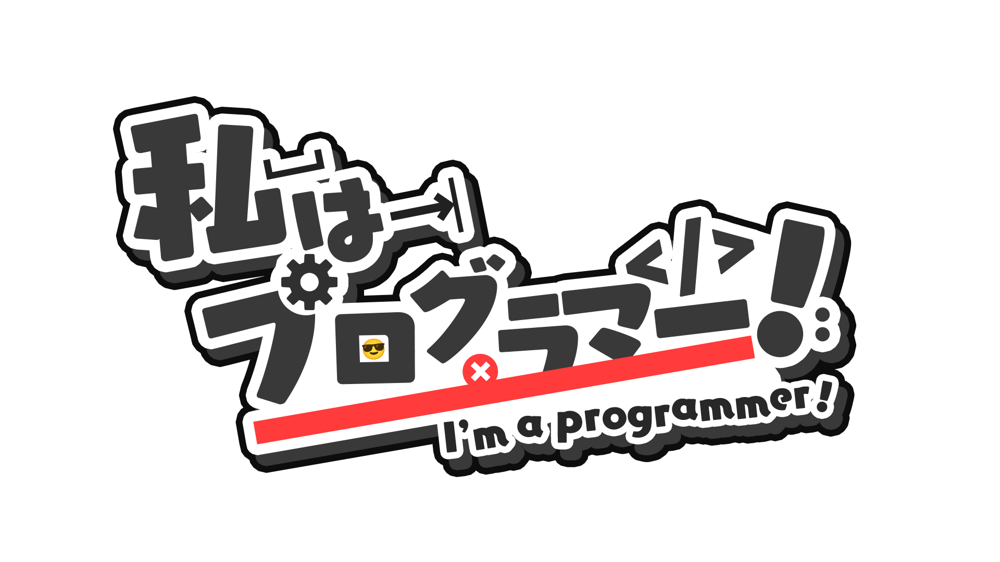

<small>(Source: [SAWARATSUKI/KawaiiLogos](https://github.com/SAWARATSUKI/KawaiiLogos/blob/main/IamSeries/IamProgrammer!.png))</small>

**Yu-Chen Cheng** is a software engineer at **Heywhale**, focusing on building AI/LLM infrastructure based on Kubernetes. Prior to Heywhale, he worked in a quantitative hedge fund as an AI platform development engineer, responsible for building machine learning platform based on Kubernetes. He holds M.Eng. and B.Eng. in software engineering from Shanghai Jiao Tong University.

- **GitHub:** [@rudeigerc](https://github.com/rudeigerc)
- **Medium:** [@rudeigerc](https://medium.com/@rudeigerc)
- **Zhihu:** [@rudeigerc](https://www.zhihu.com/people/rudeigerc)

[[Résumé]](/files/resume.pdf) [[简历]](/files/resume_zh.pdf)

 

